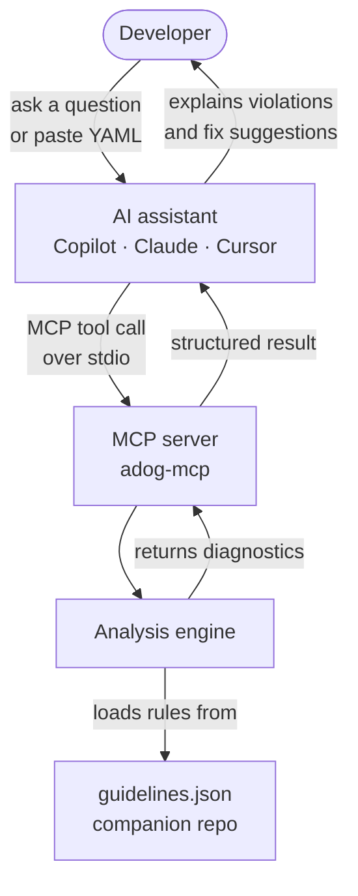
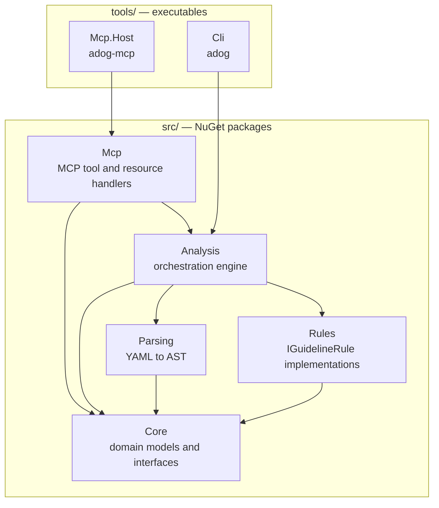

# Azure Pipelines Guidelines MCP Server and CLI

A sample [Model Context Protocol (MCP) specification](https://modelcontextprotocol.io) server and CLI analyzer
built on the [Azure Pipelines Guidelines repository](https://github.com/ruijarimba/azure-pipelines-guidelines).

## Why use it?

Use this project when you want to:

- check Azure Pipelines YAML locally or in CI with rule-backed diagnostics
- give an AI assistant live access to Azure Pipelines guidance through MCP
- review violations with stable rule IDs and fix suggestions

## What is this?

Azure Pipelines is Microsoft's CI/CD platform. Writing correct, consistent pipelines is hard —
especially on teams where not everyone knows the best practices.

The [Azure Pipelines Guidelines repository](https://github.com/ruijarimba/azure-pipelines-guidelines)
defines best-practice rules as a machine-readable manifest. This repository
**implements the tooling** that makes those rules actionable:

| Tool | What it does |
| --- | --- |
| **CLI (`adog`)** | Analyzes Azure Pipelines YAML files against the guidelines. Reports violations with fix suggestions. Run it locally or in CI. |
| **MCP server (`adog-mcp`)** | Exposes the same analysis as an AI assistant integration. Your AI tool can call it to look up guidelines and analyze pipeline YAML in real time. |

## What is MCP?

[Model Context Protocol (MCP)](https://modelcontextprotocol.io) is an open standard that lets AI
assistants connect to external tools and data sources. Think of it as a plugin system for AI:
instead of relying only on training data, the assistant calls a running server to get live,
structured results.

Here is how the MCP server fits into your workflow:



The server runs as a local process. The AI client starts it and communicates over `stdin`/`stdout`.
No network port is opened.

Without the MCP server, the AI can only advise based on training data. With it running, the AI
analyzes your actual pipeline file against the current guidelines and returns precise,
rule-keyed diagnostics.

## What does it analyze?

The guidelines cover seven categories of Azure Pipelines YAML. Each rule has a stable ID in the
form `ADOG-{CATEGORY}-{NNN}`.

| Category | Covers |
| --- | --- |
| `GENERAL` | Pipeline-wide structural rules |
| `JOBS` | Job definition best practices |
| `PARAMETERS` | Parameter declaration and defaults |
| `PIPELINES` | Pipeline-level settings |
| `STAGES` | Stage structure and ordering |
| `STEPS` | Step and task guidelines |
| `VARIABLES` | Variable declarations and scoping |

For the full rule list and definitions, see the
[Azure Pipelines Guidelines repository](https://github.com/ruijarimba/azure-pipelines-guidelines).

## Prerequisites

| Option | Requirement |
| --- | --- |
| CLI or MCP server as a global tool | [Download the .NET 10 SDK](https://dotnet.microsoft.com/download/dotnet/10.0) |
| MCP server as a Docker container | [Install Docker Desktop](https://docs.docker.com/get-docker/) — no .NET required |

## Getting started

### Option 1 — CLI static analyzer

Install the CLI as a [.NET global tool](https://learn.microsoft.com/dotnet/core/tools/global-tools) and
run it against one or more pipeline files or directories:

```bash
dotnet tool install -g adog
adog analyze azure-pipelines.yml
adog analyze path/to/pipelines path/to/another-pipeline.yml
adog analyze path/to/pipelines-directory
```

The analyzer accepts `.yml` and `.yaml` files, and it expands directories recursively to find
pipeline YAML files.

Example output:

```
azure-pipelines.yml(12,17): warning ADOG-STEPS-001: Steps template reads a pipeline variable with $(DEPLOY_ENV). Pass values as parameters instead.
  Fix: Replace pipeline variable reads in steps templates with template parameters.
  https://github.com/ruijarimba/azure-pipelines-guidelines/blob/main/guidelines/steps/avoid-pipeline-variables.md

0 errors, 1 warning.
```

Other commands:

```bash
adog rules list                      # list all rules
adog rules list --category steps     # filter by category
adog rules show ADOG-STEPS-001       # show a rule with fix guidance
```

Exit codes: `0` = no violations, `1` = violations found, `2` = analysis error.

### Option 2 — MCP server (global tool)

Install the MCP server. Your AI client starts it as a child process and communicates over stdio.

```bash
dotnet tool install -g adog-mcp
```

**Claude Desktop** (`claude_desktop_config.json`):

```json
{
  "mcpServers": {
    "azure-pipelines-guidelines": {
      "command": "adog-mcp"
    }
  }
}
```

**GitHub Copilot in VS Code** (`.vscode/mcp.json` in your project):

```json
{
  "servers": {
    "azure-pipelines-guidelines": {
      "type": "stdio",
      "command": "adog-mcp"
    }
  }
}
```

### Option 3 — MCP server (Docker, no .NET required)

```bash
docker pull ruijarimba/azure-pipelines-guidelines-mcp:latest
```

**Claude Desktop** (`claude_desktop_config.json`):

```json
{
  "mcpServers": {
    "azure-pipelines-guidelines": {
      "command": "docker",
      "args": ["run", "-i", "--rm", "ruijarimba/azure-pipelines-guidelines-mcp:latest"]
    }
  }
}
```

The `-i` flag keeps stdin open, which is required for the stdio transport.

## Architecture

The solution is a layered .NET 10 library stack. Two entry points share the same analysis engine.



`Core` has no internal project dependencies. All `src/` libraries are independent NuGet packages
under `AzurePipelines.Guidelines.*`.

For the full dependency graph, layer responsibilities, and extension points, see
[the architecture guide](docs/architecture.md).

## How it works

For a walkthrough of the MCP request cycle, the analysis pipeline, and the two-repository model,
see [the how-it-works guide](docs/how-it-works.md).

## Repository structure

```
src/       Class libraries published as NuGet packages
           Core · Parsing · Rules · Analysis · Mcp
tools/     Executable entry points
           Cli (adog) · Mcp.Host (adog-mcp)
tests/     Unit test projects, one per src/ library
docs/      Architecture, decisions, glossary, and vision documents
.github/   AI agent instructions, prompt files, and CI workflows
```

## Companion repository

The rule definitions live in the
[Azure Pipelines Guidelines repository](https://github.com/ruijarimba/azure-pipelines-guidelines).
That repository owns the `data/guidelines.json` manifest and assigns rule IDs.

This repository only **implements** the tooling. It does not define or own the rules.

## Contributing

See [the contribution guide](CONTRIBUTING.md) for build instructions, how to run tests, and how to
add a new rule or MCP tool.
