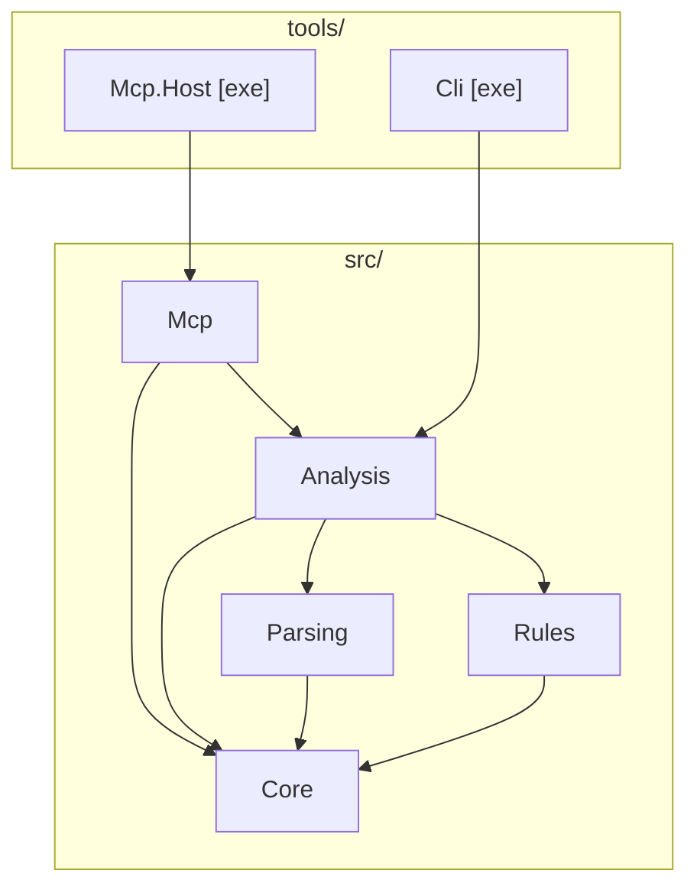

# Architecture

## Overview

This project is a layered .NET 10 solution that builds two tools on top of
the [Azure Pipelines Guidelines repository](https://github.com/ruijarimba/azure-pipelines-guidelines)
machine-readable definitions:

1. **MCP server** — AI assistants call it to look up guidelines and analyze pipeline YAML files.
2. **CLI static analyzer** (`adog`) — runs in CI or locally to flag violations.

## Dependency graph

```
AzurePipelines.Guidelines.Core
│
├── AzurePipelines.Guidelines.Parsing
│    └── [NuGet] YamlDotNet
│
├── AzurePipelines.Guidelines.Rules
│
├── AzurePipelines.Guidelines.Analysis
│    └── [NuGet] Microsoft.Extensions.DependencyInjection.Abstractions
│
└── AzurePipelines.Guidelines.Mcp
     └── [NuGet] ModelContextProtocol
     └── [NuGet] Microsoft.Extensions.Hosting.Abstractions

tools/AzurePipelines.Guidelines.Mcp.Host  [exe]
     └── AzurePipelines.Guidelines.Mcp
     └── [NuGet] Microsoft.Extensions.Hosting

tools/AzurePipelines.Guidelines.Cli  [exe]
     └── AzurePipelines.Guidelines.Analysis
     └── [NuGet] System.CommandLine
     └── [NuGet] Microsoft.Extensions.Hosting
```



**Rule:** arrows point from dependent → dependency. Cycles are forbidden.
`Core` has no internal project dependencies.

## Layer responsibilities

| Layer | Owns | Must not contain |
| --- | --- | --- |
| `Core` | Domain models, interfaces, enums, value objects | Parsing, rule logic, I/O, NuGet beyond BCL |
| `Parsing` | YAML → AST transformation via YamlDotNet | Rule logic, diagnostic generation |
| `Rules` | `IGuidelineRule` implementations keyed by `ADOG-…` ID | YAML parsing, cross-rule state, I/O |
| `Analysis` | Orchestration: parse → filter → run → aggregate | YAML details, protocol code, console I/O |
| `Mcp` | MCP tool/resource handlers, DI extension methods | Rule logic, direct YAML parsing, host lifecycle |
| `Mcp.Host` | Host wiring, DI registration, config | All business logic |
| `Cli` | Commands, output formatters, exit-code mapping | All business logic |

## Key interfaces (defined in Core)

| Interface | Purpose |
| --- | --- |
| `IPipelineParser` | Parses YAML text into a `PipelineDocument` |
| `IGuidelineRule` | Analyzes a `PipelineDocument` and returns `Diagnostic` instances |
| `IGuidelineRepository` | Loads and queries `GuidelineDefinition` records from the manifest |
| `IPipelineAnalyser` | Orchestrates parsing and rules to produce `AnalysisResult` |

## MCP tool surface

The server provides two analysis tools:

| Tool | Parameters | Returns |
| --- | --- | --- |
| `analyze_pipeline` | `yaml` (required), `guidelineIds` (optional) | Flat diagnostic list |
| `analyze_pipeline_paths` | `paths` (required), `guidelineIds` (optional) | Per-file diagnostic list |

`guidelineIds` is a comma-separated list of rule IDs (for example, `ADOG-STEPS-001,ADOG-JOBS-006`).
Omit it to run all rules.

Tool handlers live in `src/AzurePipelines.Guidelines.Mcp/Tools/` and are discovered automatically
by the MCP host via `WithToolsFromAssembly`.

## Extension points

| Goal | Where to add |
| --- | --- |
| New lint rule | Implement `IGuidelineRule` in `Rules` and register in `GuidelineRulesServiceCollectionExtensions` |
| New MCP tool | Add handler class in `Mcp/Tools/` — `WithToolsFromAssembly` discovers it automatically |
| New MCP resource | Add handler class in `Mcp/Resources/` — `WithResourcesFromAssembly` discovers it automatically |
| New CLI command | Add a `Command` subclass in `Cli` and wire it in `Program.cs` |
| New output format | Add a formatter in `Cli` (for example, SARIF) |
| Alternative YAML parser | Replace `IPipelineParser` implementation in `Parsing` |

## Guideline manifest

Rule ID pattern:

```
ADOG-(GENERAL|JOBS|PARAMETERS|PIPELINES|STAGES|STEPS|VARIABLES)-[0-9]{3}
```

For severity mapping to diagnostic level, detection kinds, and all domain terms,
see [`glossary.md`](glossary.md).

## Build infrastructure

| File | Purpose |
| --- | --- |
| `global.json` | Pins .NET SDK version |
| `Directory.Build.props` (root) | TFM, nullable, TreatWarningsAsErrors, AnalysisLevel |
| `src/Directory.Build.props` | NuGet metadata, GenerateDocumentationFile |
| `tools/Directory.Build.props` | Disables IsPackable, GenerateDocumentationFile |
| `tests/Directory.Build.props` | Disables IsPackable, suppresses CA1707 |
| `Directory.Packages.props` | Central NuGet version management |
| `.editorconfig` | C# code style rules |

## CLI surface

```
adog analyze <path> [<path> ...] [--format console|compact|json|junit|sarif|markdown] [--severity error|warning|info]
adog rules list [--category <category>] [--format console|json]
adog rules show <rule-id> [--format console|json]
```

Each `path` can point to a `.yml` or `.yaml` file, or to a directory. Directories are expanded
recursively to find pipeline YAML files. The `adog analyze` command supports multiple comma-separated
formats in a single run; the `adog rules` subcommands currently support `console` and `json`.

Exit codes: `0` = no violations at threshold, `1` = violations found, `2` = analysis error.

## NuGet packages and distribution

All `src/` projects are published as independent packages (`AzurePipelines.Guidelines.*`).

| Artefact | Package ID | Distribution |
| --- | --- | --- |
| CLI analyser | `adog` | NuGet.org global tool (`dotnet tool install -g adog`) |
| MCP server | `adog-mcp` | NuGet.org global tool (`dotnet tool install -g adog-mcp`) |
| MCP server | — | Docker Hub (`ruijarimba/azure-pipelines-guidelines-mcp`) |

`Mcp.Host` is the executable entry point for both the global tool and the Docker image.
No application code changes are needed between the two distribution forms — the same
binary runs in both contexts.
