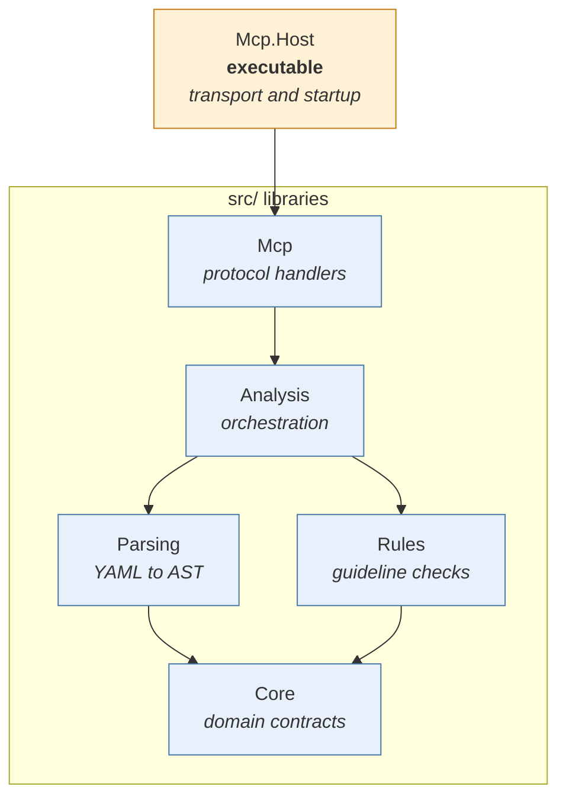

# Architecture

## Overview

This project is a layered .NET 10 solution that builds an MCP server on top of the machine-readable definitions in the [Azure Pipelines Guidelines repository](https://github.com/ruijarimba/azure-pipelines-guidelines). The server lets AI assistants look up guidelines and analyze pipelines and templates.

## At a glance

| Area | Summary |
| --- | --- |
| Solution shape | Layered .NET 10 solution with strict dependency direction |
| Main output | MCP server for AI assistants |
| Runtime boundary | `Mcp.Host` manages transport selection |

## Dependency graph



**Rule:** arrows point from dependent → dependency. Cycles are forbidden. `Core` has no internal project dependencies.

External package dependencies are kept in a table so the project graph remains readable:

| Project | External packages |
| --- | --- |
| `Mcp.Host` | `Microsoft.Extensions.Hosting`, `Microsoft.Extensions.Logging.Console`, `ModelContextProtocol.AspNetCore` |
| `Mcp` | `ModelContextProtocol`, `Microsoft.Extensions.Hosting.Abstractions`, `Microsoft.Extensions.Logging.Abstractions` |
| `Analysis` | `Microsoft.Extensions.DependencyInjection.Abstractions`, `Microsoft.Extensions.Logging.Abstractions` |
| `Parsing` | `YamlDotNet`, `Microsoft.Extensions.DependencyInjection.Abstractions` |
| `Rules` | `Microsoft.Extensions.DependencyInjection.Abstractions` |

## Layer responsibilities

| Layer | Owns | Must not contain |
| --- | --- | --- |
| `Core` | Domain models, interfaces, enums, value objects | Parsing, rule logic, I/O, NuGet beyond BCL |
| `Parsing` | YAML → AST transformation via YamlDotNet | Rule logic, diagnostic generation |
| `Rules` | `IGuidelineRule` implementations keyed by `ADOG-…` ID | YAML parsing, cross-rule state, I/O |
| `Analysis` | Orchestration: parse → filter → run → aggregate | YAML details, protocol code, console I/O |
| `Mcp` | MCP tool/resource handlers, DI extension methods | Rule logic, direct YAML parsing, host lifecycle |
| `Mcp.Host` | Host wiring, DI registration, config | All business logic |

## Key interfaces (defined in Core)

| Interface | Purpose |
| --- | --- |
| `IPipelineParser` | Parses YAML text into a `PipelineDocument` |
| `IGuidelineRule` | Analyzes a `PipelineDocument` and returns `Diagnostic` instances |
| `IGuidelineRepository` | Loads and queries `GuidelineDefinition` records from the manifest |
| `IPipelineAnalyser` | Orchestrates parsing and rules to produce `AnalysisResult` |

## MCP boundary

The `Mcp` layer exposes analysis, guideline lookup, resources, and read-only prompts through the Model Context Protocol. It maps application services and domain results to protocol contracts. It does not own parsing, rule logic, or host lifecycle.

See the [MCP Server Reference](mcp-reference.md) for the complete tool, resource, prompt, and parameter catalogue. See [MCP token usage](mcp-token-usage.md) for response-size guidance.

## Extension points

| Goal | Where to add |
| --- | --- |
| New lint rule | Implement `IGuidelineRule` in `Rules` and register in `GuidelineRulesServiceCollectionExtensions` |
| New MCP tool | Add a handler in `Mcp/Tools/`; `WithToolsFromAssembly` discovers it automatically |
| New MCP resource | Add a handler in `Mcp/Resources/`; `WithResourcesFromAssembly` discovers it automatically |
| New MCP prompt | Add a handler in `Mcp/Prompts/`; `WithPromptsFromAssembly` discovers it automatically |
| New host or tool | Compose on the `Analysis` interfaces and register adapters in a new host project |
| Alternative YAML parser | Replace the `IPipelineParser` implementation in `Parsing` |

## MCP host and transports

`Mcp.Host` selects a transport before it registers the MCP server. The application services and tool surface are the same for both transport modes.

| Transport | Host type | Use it when |
| --- | --- | --- |
| `stdio` | Generic host | The MCP client starts the server as a local child process. |
| HTTP transport | ASP.NET Core web host | The MCP client connects to an already-running server. |

The executable defaults to `stdio` for process-launching clients. Use the HTTP transport for local debugging or a hosted deployment. The existing `SSE` launch-profile and selector names start the HTTP transport for compatibility with the existing local workflow.

### Container runtime decision

The Docker image uses `mcr.microsoft.com/dotnet/aspnet:10.0` because `ModelContextProtocol.AspNetCore` requires the `Microsoft.AspNetCore.App` shared framework. The same ASP.NET runtime image supports both `stdio` and HTTP, so Docker, editor integrations, local debugging, and hosted deployments use one tested executable and runtime path.

Using the smaller `mcr.microsoft.com/dotnet/runtime:10.0` image would require separate stdio and HTTP images. The full rationale is recorded in [the MCP host README](../tools/AzurePipelines.Guidelines.Mcp.Host/README.md#container-runtime).

## Guideline manifest

Rule ID pattern:

```regex
ADOG-(GENERAL|JOBS|PARAMETERS|PIPELINES|STAGES|STEPS|VARIABLES)-[0-9]{3}
```

For severity mapping to diagnostic level, detection kinds, and all domain terms, see [`glossary.md`](glossary.md).

## Build infrastructure

| File | Purpose |
| --- | --- |
| `global.json` | Pins .NET SDK version |
| `Directory.Build.props` (root) | TFM, nullable, TreatWarningsAsErrors, AnalysisLevel |
| `src/Directory.Build.props` | NuGet metadata, GenerateDocumentationFile |
| `tools/Directory.Build.props` | Disables IsPackable, GenerateDocumentationFile |
| `tests/Directory.Build.props` | Disables IsPackable, suppresses CA1707 |
| `Directory.Packages.props` | Central NuGet version management |
| `.editorconfig` | C# code style rules |

## Packaging and distribution

The `src/` projects retain independent package metadata (`AzurePipelines.Guidelines.*`) and the MCP host retains its global-tool packaging configuration for local builds. This repository does not publish NuGet packages.

| Artefact | Package ID | Distribution |
| --- | --- | --- |
| MCP server | `adog-mcp` | Local build or Docker image |
| MCP server | — | Docker Hub (`ruijarimba/azure-pipelines-guidelines-mcp`) |

`Mcp.Host` is the executable entry point for local runs and the Docker image. No application code changes are needed between the two distribution forms — the same binary runs in both contexts.
