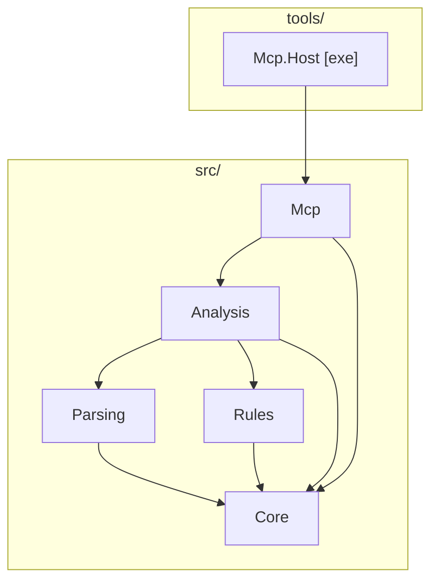

# Architecture

## Overview

This project is a layered .NET 10 solution that builds an MCP server on top of
the [Azure Pipelines Guidelines repository](https://github.com/ruijarimba/azure-pipelines-guidelines)
machine-readable definitions:

The **MCP server** lets AI assistants look up guidelines and analyze pipelines and templates.

## At a glance

| Area | Summary |
| --- | --- |
| Solution shape | Layered .NET 10 solution with strict dependency direction |
| Main output | MCP server for AI assistants |
| Runtime boundary | `Mcp.Host` manages transport selection |

## Dependency graph

```
AzurePipelines.Guidelines.Core
│
├── AzurePipelines.Guidelines.Parsing
│    └── [NuGet] YamlDotNet
│
├── AzurePipelines.Guidelines.Rules
│
├── AzurePipelines.Guidelines.Analysis
│    └── [NuGet] Microsoft.Extensions.DependencyInjection.Abstractions
│
└── AzurePipelines.Guidelines.Mcp
     └── [NuGet] ModelContextProtocol
     └── [NuGet] Microsoft.Extensions.Hosting.Abstractions

tools/AzurePipelines.Guidelines.Mcp.Host  [exe]
     └── AzurePipelines.Guidelines.Mcp
     └── [NuGet] Microsoft.Extensions.Hosting

```



**Rule:** arrows point from dependent → dependency. Cycles are forbidden.
`Core` has no internal project dependencies.

## Layer responsibilities

| Layer | Owns | Must not contain |
| --- | --- | --- |
| `Core` | Domain models, interfaces, enums, value objects | Parsing, rule logic, I/O, NuGet beyond BCL |
| `Parsing` | YAML → AST transformation via YamlDotNet | Rule logic, diagnostic generation |
| `Rules` | `IGuidelineRule` implementations keyed by `ADOG-…` ID | YAML parsing, cross-rule state, I/O |
| `Analysis` | Orchestration: parse → filter → run → aggregate | YAML details, protocol code, console I/O |
| `Mcp` | MCP tool/resource handlers, DI extension methods | Rule logic, direct YAML parsing, host lifecycle |
| `Mcp.Host` | Host wiring, DI registration, config | All business logic |

## Key interfaces (defined in Core)

| Interface | Purpose |
| --- | --- |
| `IPipelineParser` | Parses YAML text into a `PipelineDocument` |
| `IGuidelineRule` | Analyzes a `PipelineDocument` and returns `Diagnostic` instances |
| `IGuidelineRepository` | Loads and queries `GuidelineDefinition` records from the manifest |
| `IPipelineAnalyser` | Orchestrates parsing and rules to produce `AnalysisResult` |

## MCP tool surface

The server provides one analysis tool:

| Tool | Parameters | Returns |
| --- | --- | --- |
| `analyze_template` | Exactly one of `yaml` or `fileOrPath`, plus optional filters | Summary plus diagnostics or per-file diagnostic lists |

`guidelineIds` is a comma-separated list of rule IDs (for example, `ADOG-STEPS-001,ADOG-JOBS-006`).
By default only rules with automation status `Enforceable` are evaluated. Pass
`includeNonEnforceable: true` to also include heuristic and non-automatable rules. When
`guidelineIds` is provided, the enforceable-only filter is bypassed.

The analysis tool returns a structured response with a `summary` containing the number of files
analysed, files with findings, total findings, and optional counts grouped by recommendation,
category, and rule. Inline `yaml` places detailed findings in `diagnostics`; `fileOrPath` places
them in `files`, grouped by path. Empty grouping fields are omitted to keep responses compact.

Guideline lookup is also exposed through MCP tools and resources:

- `list_guidelines`, `get_guideline`, `search_guidelines`, and `list_categories` browse the loaded catalogue.
- `get_guideline` returns a compact summary by default and switches to the full detail payload only when `detail=full` is requested.
- `explain_diagnostic` returns one guideline's full detail by ID, optionally echoing back the diagnostic message, file path, line, and column that raised it. It never returns the full catalogue.
- Resource endpoints such as `adog://guidelines/version` and `adog://guidelines/category/{category}` let clients cache the catalogue and fetch narrower slices of data.

Tool handlers live in `src/AzurePipelines.Guidelines.Mcp/Tools/` and are discovered automatically
by the MCP host via `WithToolsFromAssembly`.

Read-only prompt handlers live in `src/AzurePipelines.Guidelines.Mcp/Prompts/` and are discovered
via `WithPromptsFromAssembly`. Prompt handlers guide the MCP client toward the existing tools and
resources; they do not modify pipeline files. Their user-facing output uses guideline recommendation
labels (`DO`, `DO-NOT`, `AVOID`, `CONSIDER`) instead of diagnostic severity labels.

## MCP host and transports

`Mcp.Host` selects a transport before it registers the MCP server. The application services and
tool surface are the same for both transport modes.

| Transport | Host type | Use it when |
| --- | --- | --- |
| `stdio` | Generic host | The MCP client starts the server as a local child process. |
| HTTP transport | ASP.NET Core web host | The MCP client connects to an already-running server. |

The executable defaults to `stdio` for process-launching clients. Use the HTTP transport for
local debugging or a hosted deployment. The existing `SSE` launch-profile and selector names
start the HTTP transport for compatibility with the existing local workflow.

### Container runtime decision

The Docker image uses `mcr.microsoft.com/dotnet/aspnet:10.0`. `Mcp.Host` references
`ModelContextProtocol.AspNetCore` to provide the HTTP transport, which requires the
`Microsoft.AspNetCore.App` shared framework. The smaller `mcr.microsoft.com/dotnet/runtime:10.0`
image does not include that framework.

.NET resolves shared-framework requirements when the executable starts. Therefore, the host needs
the ASP.NET runtime even when it runs with the `stdio` transport. A single image keeps Docker,
editor integrations, local HTTP debugging, and hosted deployments on the same tested executable.

Using `runtime` would require two images: a stdio-only image without the ASP.NET Core dependency
and an HTTP image with it. Each image would need its own build, tests, tags, publishing, version
checks, support guidance, and user documentation. The project accepts the larger ASP.NET image to
keep one release artifact and one supported runtime path.

## Extension points

| Goal | Where to add |
| --- | --- |
| New lint rule | Implement `IGuidelineRule` in `Rules` and register in `GuidelineRulesServiceCollectionExtensions` |
| New MCP tool | Add handler class in `Mcp/Tools/` — `WithToolsFromAssembly` discovers it automatically |
| New MCP resource | Add handler class in `Mcp/Resources/` — `WithResourcesFromAssembly` discovers it automatically |
| New MCP prompt | Add handler class in `Mcp/Prompts/` — `WithPromptsFromAssembly` discovers it automatically |
| New host or tool | Compose on the `Analysis` interfaces and register adapters in a new host project |
| Alternative YAML parser | Replace `IPipelineParser` implementation in `Parsing` |

## Guideline manifest

Rule ID pattern:

```
ADOG-(GENERAL|JOBS|PARAMETERS|PIPELINES|STAGES|STEPS|VARIABLES)-[0-9]{3}
```

For severity mapping to diagnostic level, detection kinds, and all domain terms,
see [`glossary.md`](glossary.md).

## Build infrastructure

| File | Purpose |
| --- | --- |
| `global.json` | Pins .NET SDK version |
| `Directory.Build.props` (root) | TFM, nullable, TreatWarningsAsErrors, AnalysisLevel |
| `src/Directory.Build.props` | NuGet metadata, GenerateDocumentationFile |
| `tools/Directory.Build.props` | Disables IsPackable, GenerateDocumentationFile |
| `tests/Directory.Build.props` | Disables IsPackable, suppresses CA1707 |
| `Directory.Packages.props` | Central NuGet version management |
| `.editorconfig` | C# code style rules |

## Packaging and distribution

The `src/` projects retain independent package metadata (`AzurePipelines.Guidelines.*`) and the
MCP host retains its global-tool packaging configuration for local builds. This repository does
not publish NuGet packages.

| Artefact | Package ID | Distribution |
| --- | --- | --- |
| MCP server | `adog-mcp` | Local build or Docker image |
| MCP server | — | Docker Hub (`ruijarimba/azure-pipelines-guidelines-mcp`) |

`Mcp.Host` is the executable entry point for local runs and the Docker image. No application code
changes are needed between the two distribution forms — the same binary runs in both contexts.
