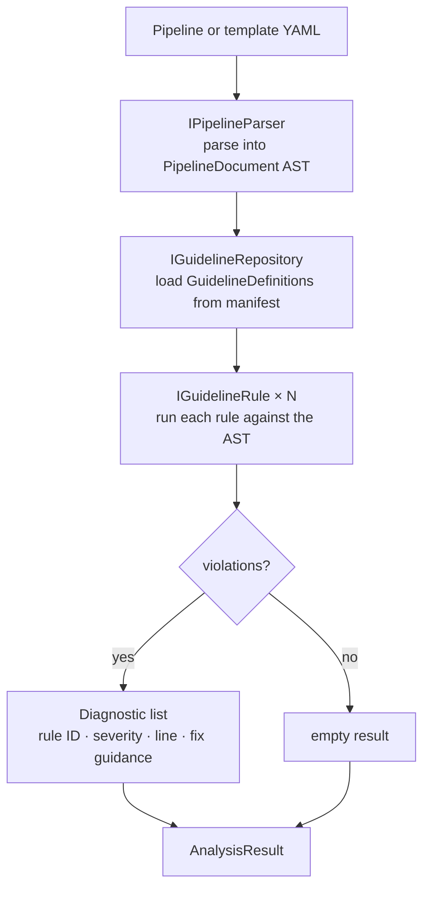
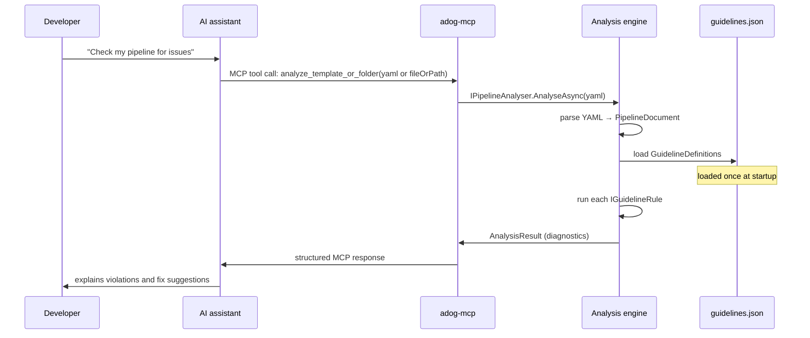

# How it works

This document explains the two-repository model, the MCP request lifecycle, and the internal analysis pipeline. For the dependency graph and layer responsibilities, see [the architecture guide](architecture.md).

## The two-repository model

This project is one half of a two-repository system.

| Repository | Purpose |
| --- | --- |
| [Azure Pipelines Guidelines repository](https://github.com/ruijarimba/azure-pipelines-guidelines) | Defines the rules. Each rule has an ID, severity, detection hints, and fix guidance, stored in `data/guidelines.json`. |
| [this repository](https://github.com/ruijarimba/azure-pipelines-guidelines-ai-mcp) | Implements the tooling that reads the manifest and enforces the rules. |

Keeping rule definitions and tool implementation in separate repositories means either can evolve independently. The tooling loads the manifest at startup; updating rules does not require rebuilding the tools.

The analysis pipeline is static, deterministic, and rule-based. The connected AI client may explain the returned results, but that explanation does not come from the server.

## The analysis pipeline

Every MCP analysis request runs through the shared analysis engine.



Each `IGuidelineRule` implementation maps to one `ADOG-{CATEGORY}-{NNN}` rule from the manifest. The rule examines the parsed AST and returns `Diagnostic` instances for each violation it finds.

## How the MCP server handles a request

When an AI assistant calls the MCP server, the following steps happen:



The MCP server supports both a local **stdio** transport and an **HTTP transport** for local debugging or hosted connections. The stdio mode launches `adog-mcp` as a child process and uses `stdin`/`stdout`; the HTTP mode exposes the `/mcp` endpoint and also supports the legacy SSE compatibility path for local debugging workflows.

The MCP server exposes six tools: one analysis tool and five guideline lookup tools, plus resource endpoints for the guideline catalogue.

- `analyze_template_or_folder` accepts exactly one of inline `yaml` or a `fileOrPath` file or directory
  target. It covers full pipelines and steps, jobs, stages, and variables templates.
- `list_guidelines`, `get_guideline`, `search_guidelines`, and `list_categories` browse the
  loaded guideline catalogue.
- `get_guideline` returns a compact summary by default and only returns the full detail payload
  when `detail=full` is requested.
- `explain_diagnostic` returns one guideline's full detail by ID, optionally echoing back the
  diagnostic message, file path, line, and column that raised it.
- Resource endpoints such as `adog://guidelines/version` and
  `adog://guidelines/category/{category}` let clients cache the catalogue and fetch narrower
  slices of data.

The analysis tool accepts an optional `guidelineIds` parameter. Pass a comma-separated list such as `ADOG-STEPS-001,ADOG-JOBS-006` to restrict analysis to specific rules. By default, only rules with automation status `Enforceable` are checked. Set `includeNonEnforceable: true` to also run heuristic and non-automatable rules. When `guidelineIds` is provided, the enforceable-only filter is bypassed — the explicit list already expresses the caller's intent.

## Detection kinds

Each guideline in the manifest specifies how a violation should be detected.

| Kind | How it works | Phase |
| --- | --- | --- |
| `Regex` | Matches patterns in the raw YAML text | Phase 1 ✓ |
| `YamlPath` | Queries specific nodes in the parsed AST | Phase 1 ✓ |

Phase 1 implements all `Regex` and `YamlPath` rules.

## Guideline rule IDs

Every rule has a stable ID that is never reused:

```
ADOG-{CATEGORY}-{NNN}
```

Examples: `ADOG-STEPS-001`, `ADOG-VARIABLES-003`, `ADOG-GENERAL-002`.

Rule IDs appear in:

- `Diagnostic` output from MCP tools
- The manifest (`data/guidelines.json` in the companion repository)
- The `IGuidelineRule.GuidelineId` property of each rule implementation

For the full severity mapping (`Do`/`DoNot` → Error, `Avoid` → Warning, `Consider` → Info), see [the glossary reference](glossary.md).

