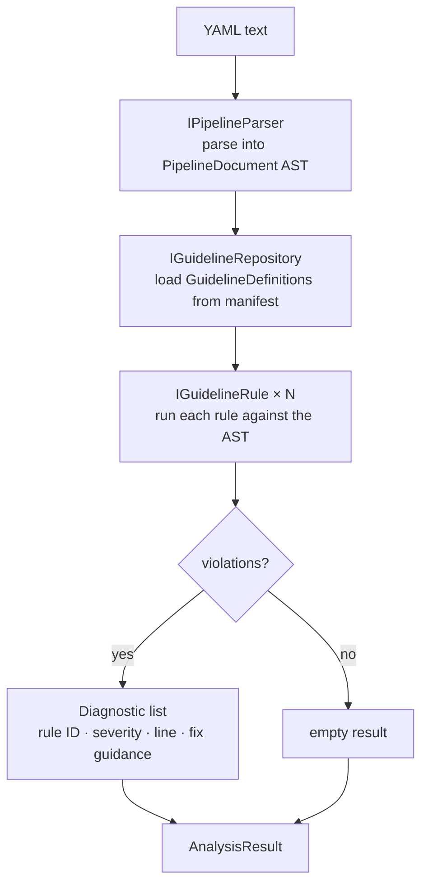
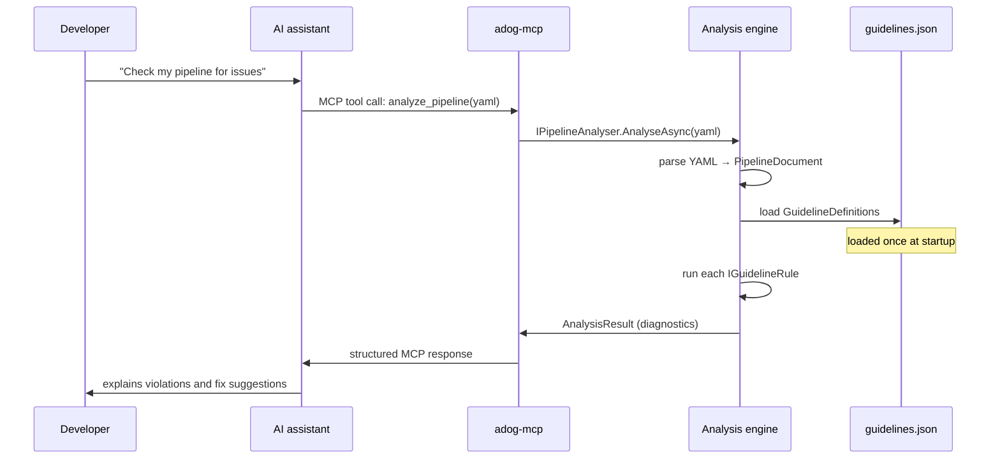

# How it works

This document explains the two-repository model, the MCP request lifecycle, and the internal
analysis pipeline. For the dependency graph and layer responsibilities, see
[the architecture guide](architecture.md).

## The two-repository model

This project is one half of a two-repository system.

| Repository | Purpose |
| --- | --- |
| [Azure Pipelines Guidelines repository](https://github.com/ruijarimba/azure-pipelines-guidelines) | Defines the rules. Each rule has an ID, severity, detection hints, and fix guidance, stored in `data/guidelines.json`. |
| [this repository](https://github.com/ruijarimba/azure-pipelines-guidelines-ai-mcp) | Implements the tooling that reads the manifest and enforces the rules. |

Keeping rule definitions and tool implementation in separate repositories means either can evolve
independently. The tooling loads the manifest at startup; updating rules does not require
rebuilding the tools.

## The analysis pipeline

Every analysis request — whether from the CLI or the MCP server — runs through the same engine.



Each `IGuidelineRule` implementation maps to one `ADOG-{CATEGORY}-{NNN}` rule from the manifest.
The rule examines the parsed AST and returns `Diagnostic` instances for each violation it finds.

Schema validation is a separate concern from guideline analysis. See the
[Azure Pipelines YAML schema guide](azure-pipelines-schema.md) for the official Microsoft Learn
reference, planned local validation scope, and optional Microsoft Learn MCP workflow.

## How the MCP server handles a request

When an AI assistant calls the MCP server, the following steps happen:



The server uses **stdio transport**: the AI client starts `adog-mcp` as a child process and
communicates with it over `stdin`/`stdout`. No network port is opened.

The MCP server exposes six tools: two analysis tools and four guideline lookup tools.

- `analyze_pipeline` accepts YAML text and returns a flat list of diagnostics.
- `analyze_pipeline_paths` accepts one or more file or directory paths and returns per-file results.
- `list_guidelines`, `get_guideline`, `search_guidelines`, and `list_categories` browse the
  loaded guideline catalogue.

Both tools accept an optional `guidelineIds` parameter. Pass a comma-separated list such as
`ADOG-STEPS-001,ADOG-JOBS-006` to restrict analysis to specific rules. Omit it to run all rules.

Both tools use the same analysis engine as the CLI.

## How the CLI works

The CLI (`adog`) uses the same analysis engine. The difference is the entry point and output
format.

| | CLI (`adog`) | MCP server (`adog-mcp`) |
| --- | --- | --- |
| Caller | Human or CI pipeline | AI assistant (MCP client) |
| Input | One or more file or directory paths | YAML text (`analyze_pipeline`) or file paths (`analyze_pipeline_paths`) |
| Output | Console text or JSON | Structured MCP response (JSON) |
| Transport | Standard file I/O | stdio JSON-RPC |

The CLI expands each directory recursively and analyzes every `.yml` and `.yaml` file it finds.

## Detection kinds

Each guideline in the manifest specifies how a violation should be detected.

| Kind | How it works | Phase |
| --- | --- | --- |
| `Regex` | Matches patterns in the raw YAML text | Phase 1 ✓ |
| `YamlPath` | Queries specific nodes in the parsed AST | Phase 1 ✓ |
| `Heuristic` | Requires reasoning about intent or architecture | Phase 2 (LLM-assisted) |

Phase 1 implements all `Regex` and `YamlPath` rules. `Heuristic` rules are deferred to Phase 2
because they require contextual reasoning that static analysis cannot reliably provide. See
[ADR-013 in the architecture decisions record](decisions.md) for the rationale.

## Guideline rule IDs

Every rule has a stable ID that is never reused:

```
ADOG-{CATEGORY}-{NNN}
```

Examples: `ADOG-STEPS-001`, `ADOG-VARIABLES-003`, `ADOG-GENERAL-002`.

Rule IDs appear in:

- `Diagnostic` output from the CLI and MCP server
- The manifest (`data/guidelines.json` in the companion repository)
- The `IGuidelineRule.GuidelineId` property of each rule implementation

For the full severity mapping (`Do`/`DoNot` → Error, `Avoid` → Warning, `Consider` → Info), see
[the glossary reference](glossary.md).
