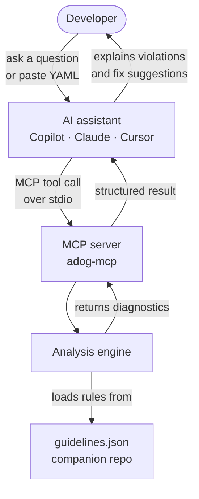

# MCP Server Reference — `adog-mcp`

The `adog-mcp` MCP server gives AI assistants live access to Azure Pipelines coding guideline analysis. Instead of relying only on training data, your AI tool can analyze your actual pipeline files against the current guidelines and return precise, rule-keyed diagnostics.

## Table of Contents

- [What is MCP?](#what-is-mcp)
- [How it works](#how-it-works)
- [Installation](#installation)
  - [Option 1 — Local clone](#option-1--local-clone)
  - [Option 2 — Local Docker image](#option-2--local-docker-image)
- [Configuration](#configuration)
  - [Claude Desktop](#claude-desktop)
  - [GitHub Copilot (VS Code)](#github-copilot-vs-code)
  - [Cline](#cline)
- [Debug mode with Visual Studio](#debug-mode-with-visual-studio)
- [Available tools](#available-tools)
  - [Analysis response contract](#analysis-response-contract)
- [Usage examples](#usage-examples)
- [Troubleshooting](#troubleshooting)
- [See also](#see-also)

## What is MCP?

[Model Context Protocol (MCP)](https://modelcontextprotocol.io) is an open standard that lets AI assistants connect to external tools and data sources. Think of it as a plugin system for AI: instead of relying only on training data, the assistant calls a running server to get live, structured results.

The MCP server runs as a local process. The AI client starts it and communicates over `stdin`/`stdout`. No network port is opened.

Without the MCP server, the AI can only advise based on training data. With it running, the AI analyzes your actual pipeline file against the current guidelines and returns precise, rule-keyed diagnostics.

## How it works

Here is how the MCP server fits into your workflow:



The server runs as a child process of your AI client. Communication happens over standard input/output streams (stdio transport).

## Installation

### Option 1 — Local clone

**Prerequisites:** [.NET 10 SDK](https://dotnet.microsoft.com/download/dotnet/10.0) and a local clone of this repository.

Run the MCP server from the repository root:

```bash
pwsh ./scripts/run-mcp-local.ps1
```

The script starts the server over standard input/output. It waits for an MCP client request;
that is expected. You can also run `dotnet run --project tools/AzurePipelines.Guidelines.Mcp.Host`.

### Option 2 — Local Docker image

**Prerequisites:** [Docker Desktop](https://docs.docker.com/get-docker/)

Build the local image from the repository root:

```bash
pwsh ./scripts/build-mcp-image.ps1
```

The script creates `adog-mcp:local` without using Docker Hub. To use a different tag, pass
`-ImageTag <tag>`. A manually started container waits for MCP input:

```bash
docker run -i --rm adog-mcp:local
```

## Configuration

MCP analysis defaults are configured when the server process starts. They apply to both
`analyze_pipeline` and `analyze_pipeline_paths` when the corresponding tool argument is omitted.
An explicit argument in an MCP tool call takes precedence over the server default.

| Analysis option | Command-line option | Environment variable | Default | Accepted values |
| --- | --- | --- | --- | --- |
| Guideline filter | `--guideline-ids <ids>` | `ADOG_MCP_GUIDELINE_IDS` | all guidelines | Comma-separated guideline IDs |
| Category filter | `--category <categories>` | `ADOG_MCP_CATEGORY` | all categories | Comma-separated `general`, `jobs`, `parameters`, `pipelines`, `stages`, `steps`, or `variables` |
| Response format | `--format <format>` | `ADOG_MCP_FORMAT` | `json` | `json`, `compact`, or `markdown` |
| Remediation guidance | `--include-guidance [true\|false]` | `ADOG_MCP_INCLUDE_GUIDANCE` | `false` | `true`/`false`, `1`/`0`, `yes`/`no`; Markdown includes guidance automatically |
| Heuristic rules | `--include-heuristics [true\|false]` | `ADOG_MCP_INCLUDE_HEURISTICS` | `false` | `true`/`false`, `1`/`0`, `yes`/`no` |

The effective-value precedence is:

1. Explicit MCP tool-call argument
2. Server command-line option
3. Server environment variable
4. Built-in default

The server always evaluates enforceable rules and never evaluates `notAutomatable` rules.
Set `includeHeuristics` to `true` in a tool call, or configure the server default, to include
optional heuristic findings. Invalid startup values prevent the server from starting with a
configuration error.

### Complete server configuration example

The following VS Code stdio configuration shows every analysis option. The `env` values are
equivalent to the command-line arguments shown in the `args` array; configure each option in one
place rather than setting both forms.

```json
{
  "servers": {
    "azure-pipelines-guidelines": {
      "type": "stdio",
      "command": "dotnet",
      "args": [
        "run",
        "--project",
        "/absolute/path/to/azure-pipelines-guidelines-ai-mcp/tools/AzurePipelines.Guidelines.Mcp.Host",
        "--",
        "--guideline-ids",
        "ADOG-STEPS-001,ADOG-JOBS-006",
        "--category",
        "steps,jobs",
        "--format",
        "markdown",
        "--include-guidance",
        "true",
        "--include-heuristics",
        "true"
      ],
      "env": {
        "ADOG_MCP_GUIDELINE_IDS": "ADOG-STEPS-001,ADOG-JOBS-006",
        "ADOG_MCP_CATEGORY": "steps,jobs",
        "ADOG_MCP_FORMAT": "markdown",
        "ADOG_MCP_INCLUDE_GUIDANCE": "true",
        "ADOG_MCP_INCLUDE_HEURISTICS": "true"
      }
    }
  }
}
```

To use the built-in defaults instead, omit the analysis arguments and environment variables:
all guideline IDs and categories, `json` format, and both boolean options set to `false`.

For an HTTP/SSE server, these settings belong to the process that starts the server. The VS Code
client configuration only selects the endpoint:

```json
{
  "servers": {
    "azure-pipelines-guidelines": {
      "type": "http",
      "url": "http://localhost:5050/mcp"
    }
  }
}
```

Start that server with command-line defaults:

```powershell
dotnet run --project tools/AzurePipelines.Guidelines.Mcp.Host -- --transport sse --urls "http://localhost:5050" --include-heuristics true --format markdown
```

Or with environment defaults:

```powershell
$env:ADOG_MCP_INCLUDE_HEURISTICS = "true"
$env:ADOG_MCP_FORMAT = "markdown"
dotnet run --project tools/AzurePipelines.Guidelines.Mcp.Host -- --transport sse --urls "http://localhost:5050"
```

### Claude Desktop

Edit your Claude Desktop configuration file:

**Windows:**
```
%APPDATA%\Claude\claude_desktop_config.json
```

**macOS:**
```
~/Library/Application Support/Claude/claude_desktop_config.json
```

**Linux:**
```
~/.config/Claude/claude_desktop_config.json
```

#### Using a local clone:

```json
{
  "mcpServers": {
    "azure-pipelines-guidelines": {
      "command": "dotnet",
      "args": [
        "run",
        "--project",
        "/absolute/path/to/azure-pipelines-guidelines-ai-mcp/tools/AzurePipelines.Guidelines.Mcp.Host",
        "--"
      ]
    }
  }
}
```

#### Using a local Docker image:

```json
{
  "mcpServers": {
    "azure-pipelines-guidelines": {
      "command": "docker",
      "args": ["run", "-i", "--rm", "adog-mcp:local"]
    }
  }
}
```

The `-i` flag keeps stdin open, which is required for the stdio transport.

### GitHub Copilot (VS Code)

Create or edit `.vscode/mcp.json` in your project:

#### Using a local clone:

```json
{
  "servers": {
    "azure-pipelines-guidelines": {
      "type": "stdio",
      "command": "dotnet",
      "args": [
        "run",
        "--project",
        "/absolute/path/to/azure-pipelines-guidelines-ai-mcp/tools/AzurePipelines.Guidelines.Mcp.Host",
        "--"
      ]
    }
  }
}
```

#### Using a local Docker image:

```json
{
  "servers": {
    "azure-pipelines-guidelines": {
      "type": "stdio",
      "command": "docker",
      "args": ["run", "-i", "--rm", "adog-mcp:local"]
    }
  }
}
```

### Cline

Cline follows the Claude Desktop configuration format. Edit your Cline MCP settings file and use the same JSON structure as shown in the [Claude Desktop](#claude-desktop) section above.

## Available tools

The MCP server exposes six tools in the current implementation:

| Tool | Purpose |
| --- | --- |
| `analyze_pipeline` | Analyze inline YAML content |
| `analyze_pipeline_paths` | Analyze files or directories on disk |
| `list_guidelines` | List guidelines from the manifest |
| `get_guideline` | Show a single guideline by ID |
| `search_guidelines` | Search guidelines by text |
| `list_categories` | List the supported categories |

### Analysis response contract

Analysis findings are advisory. The MCP server returns detected findings as normal tool results;
it does not turn a guideline finding into a tool failure. Each diagnostic includes:

- `severity` — the diagnostic level used for filtering and machine-readable grouping:
  `error`, `warning`, or `info`
- `guidance` — the original wording from the guideline: `do`, `don't`, `avoid`, or `consider`
- `ruleId`, `message`, and an optional `line` number

The `guidance` value describes the tone of the guideline. It does not use stronger wording such as
"required" or "prohibited". Operational problems, such as invalid parameters, YAML parsing
failures, missing paths, or file read failures, are returned separately as error responses.

For example, an inline analysis can return a diagnostic like this:

```json
{
  "ruleId": "ADOG-STEPS-001",
  "severity": "error",
  "guidance": "do",
  "message": "Use a template for repeated steps.",
  "line": 12
}
```

The `severity` and `guidance` fields serve different purposes. A response can contain findings
with different advisory labels:

```json
[
  { "ruleId": "ADOG-STEPS-001", "severity": "error", "guidance": "do" },
  { "ruleId": "ADOG-VARIABLES-003", "severity": "error", "guidance": "don't" },
  { "ruleId": "ADOG-JOBS-006", "severity": "warning", "guidance": "avoid" },
  { "ruleId": "ADOG-STEPS-004", "severity": "info", "guidance": "consider" }
]
```

For `analyze_pipeline_paths` with `format: "markdown"`, the rule summary includes the same
advisory wording:

```text
| Rule | Title | Count | Advisory | Guidance |
| --- | --- | ---: | --- | --- |
| ADOG-JOBS-006 | Set job timeouts | 1 | avoid | Add a timeout to long-running jobs. |
```

### `analyze_pipeline`

Analyzes inline Azure Pipelines YAML content.

**Input:**
- `yaml` (string, required) — The pipeline YAML to analyze
- `guidelineIds` (string, optional) — Comma-separated list of rule IDs to check. If omitted, all rules are checked.
- `category` (string, optional) — Category filter for analysis options
- `format` (string, optional) — `json` (default) for diagnostics and rule summaries or `compact`
  for findings only
- `includeGuidance` (boolean, optional) — Include the guideline's remediation summary in the
  `rules` array. Defaults to `false`.
- `includeHeuristics` (boolean, optional) — Include heuristic rules. Defaults to `false` because
  these findings can be noisy.

**Returns:**
- `diagnostics`: line-level findings with rule ID, severity, advisory `guidance`, message, and
  optional line number
- `rules`: one compact summary per finding, with its title, advisory label, optional remediation
  `guidance`, and reference URLs
- `skippedGuidelines`: rules not evaluated by the automation policy, with their ID, automation
  status, and reason
- Render returned reference URLs as Markdown links; call `get_guideline` for full descriptions,
  rationale, and before/after fix examples

The diagnostic `guidance` label is always included when the guideline is known. The `rules[].guidance`
value is different: it is an optional remediation summary controlled by `includeGuidance`.
The analyzer runs enforceable rules by default. It always skips not-automatable rules. Set
`includeHeuristics` to `true` for optional advisory findings. See
[guideline automation status](guideline-automation.md) for every rule's status and reason.

### `analyze_pipeline_paths`

Analyzes one or more pipeline files or directories on disk.

**Input:**
- `paths` (array of strings, required) — File paths or directory paths to analyze
- `guidelineIds` (string, optional) — Comma-separated list of rule IDs to check
- `category` (string, optional) — Category filter for analysis options
- `format` (string, optional) — `json` (default) for structured output, `compact` for findings
  only, or `markdown` for a compact user-facing report
- `includeGuidance` (boolean, optional) — Include remediation summaries in JSON rule details.
  Defaults to `false`; Markdown includes them automatically.
- `includeHeuristics` (boolean, optional) — Include heuristic rules. Defaults to `false` because
  these findings can be noisy.

**Returns:**
- With `format: json`, `files` contains per-file diagnostics with advisory labels and `rules`
  contains compact, deduplicated rule summaries with advisory labels, optional remediation
  guidance, reference URLs, and skipped-guideline details.
- With `format: markdown`, a compact report contains severity counts, linked rule IDs, advisory
  labels, remediation guidance, and per-file counts. A rule ID links to its first valid HTTP(S)
  manifest reference; IDs remain
  unlinked when the manifest has no valid reference URL.
- Call `get_guideline` for full remediation details when needed.

For either analysis tool, `format: compact` returns only the findings needed for a low-token review.
Inline analysis returns a `findings` array; path analysis returns `files`, each with a `file` path and
`findings` array. Compact findings contain `ruleId`, `severity`, advisory `guidance`, `message`, and
an optional `line`; path findings also include the source `file`. Compact responses omit `rules` and
remediation summaries. Use the default JSON response or `get_guideline` when rule metadata is needed.

#### File-access boundary

The server reads files with the permissions of the process started by your AI client. Use only
workspace paths that you intend the server to analyze. Do not configure the client to run the
server with access to directories that contain secrets, credentials, or unrelated sensitive files.

When using Docker, the container cannot read host files unless you explicitly mount a directory.
Mount only the workspace or pipeline directory you want to analyze as read-only, then pass paths
inside that container mount to `analyze_pipeline_paths`. For example, add these arguments before
the `adog-mcp:local` image tag in the MCP client configuration:

```json
[
  "--mount",
  "type=bind,source=H:\\src\\pipeline-repository,target=/workspace,readonly"
]
```

Use `/workspace/azure-pipelines.yml` when calling the file-path analysis tool. Replace the
example source path with the absolute host path that Docker Desktop can access.

### Guideline lookup tools

The server also exposes lookup helpers for the guideline catalogue:

- `list_guidelines` returns the available guidelines
- `get_guideline` returns the details for one specific guideline ID
- `search_guidelines` searches by text
- `list_categories` lists the supported categories

## Usage examples

### Ask about a specific guideline

> "What does rule ADOG-STEPS-001 check for?"

The AI will use the MCP server to look up the rule details and explain it.

### Analyze inline YAML

> "Review this pipeline for issues:
> ```yaml
> steps:
>   - script: echo $(DEPLOY_ENV)
> ```"

The AI will call `analyze_pipeline` with your YAML snippet and report any violations.

### Analyze files in your workspace

> "Check all pipeline files in the `.azuredevops` directory"

The AI will call `analyze_pipeline_paths` with the directory path and summarize findings.

### Filter by specific rules

> "Check this pipeline for timeout issues only"

The AI can filter by category (e.g., `ADOG-JOBS-*`, `ADOG-STEPS-*`) or specific rule IDs.

## Debug mode with Visual Studio

The default stdio transport keeps the protocol stream tied to the client process. That makes
it hard to debug the server inside Visual Studio while a second tool such as VS Code uses it.

For that workflow, use the optional **SSE transport**. The server listens on a local HTTP port,
so you can start it in Visual Studio and connect VS Code to the running instance.

### 1. Start the server in Visual Studio in SSE mode

In Visual Studio, set the run/debug profile to **SSE** before you start debugging:

1. Open the `tools/AzurePipelines.Guidelines.Mcp.Host` project.
2. In the toolbar, click the run/debug profile dropdown (normally shows the project name).
3. Select **SSE**.
4. Press **F5** (or choose **Debug &gt; Start Debugging**).

The server defaults to `http://localhost:5050/mcp`. The process stays alive as long as the
debugger is attached, and breakpoints in the host and library projects will be hit.

To start from the command line instead of Visual Studio:

```bash
dotnet run --project tools/AzurePipelines.Guidelines.Mcp.Host -- --transport sse --urls "http://localhost:5050"
```

### 2. Configure VS Code to connect over SSE

Edit `.vscode/mcp.json` in the workspace you want the AI to analyze:

```json
{
  "servers": {
    "azure-pipelines-guidelines": {
      "type": "sse",
      "url": "http://localhost:5050/mcp"
    }
  }
}
```

Save the file. VS Code will connect to the running server. You do not need to restart the
server when you change the client configuration.

### 3. Stop the debug session

The server runs only while the Visual Studio debugger is attached. To stop it, detach or stop
debugging in Visual Studio. The VS Code client will lose its connection until you start the
server again.

### Debug notes and limitations

- SSE mode is for **local debugging only**. The default stdio transport remains the supported
  execution mode for day-to-day clients, Docker images, and CI.
- The server binds to `localhost` by default. It is not intended to be exposed to other
  machines.
- If port `5050` is in use, pass `--urls "http://localhost:<port>"` when starting from the
  command line or set `ASPNETCORE_URLS` to the replacement URL. Update the `url` value in VS
  Code's `mcp.json` to match.
- You can also switch transports with the environment variable `MCP_TRANSPORT=sse`, but the
  `--transport` command-line argument takes priority.

## Troubleshooting

### "MCP server not found" or "command not found"

**If using a local clone:**
- Verify the .NET SDK is available: `dotnet --version`
- Run `dotnet run --project tools/AzurePipelines.Guidelines.Mcp.Host` from the repository root
- Verify the configured project path is absolute and points to the MCP host project

**If using Docker:**
- Build the image: `pwsh ./scripts/build-mcp-image.ps1`
- Verify the local image: `docker image inspect adog-mcp:local`
- Ensure Docker Desktop is running

### AI assistant doesn't see the MCP server

1. **Restart the AI client** after editing the configuration file
2. **Check the config file path** — make sure you edited the correct file for your platform
3. **Validate JSON syntax** — use a JSON validator to check for syntax errors
4. **Check logs** — most MCP clients log startup issues to a developer console or log file

### "Tool execution failed"

- **For file analysis:** Ensure the file paths are absolute or relative to your workspace root
- **For directory analysis:** Verify the directory exists and contains `.yml` or `.yaml` files
- **Check permissions:** Ensure the MCP server process can read the files

### Server starts but doesn't return results

- Verify you're passing valid Azure Pipelines YAML (not GitHub Actions or GitLab CI syntax)
- Check if the YAML file is well-formed — run `adog analyze <file>` from the CLI to see detailed errors

## See also

- [CLI Reference](cli-reference.md) — command-line tool usage
- [Azure Pipelines Guidelines repository](https://github.com/ruijarimba/azure-pipelines-guidelines) — rule definitions
- [Model Context Protocol specification](https://modelcontextprotocol.io) — MCP standard documentation
- [Architecture guide](architecture.md) — how the analysis engine works
