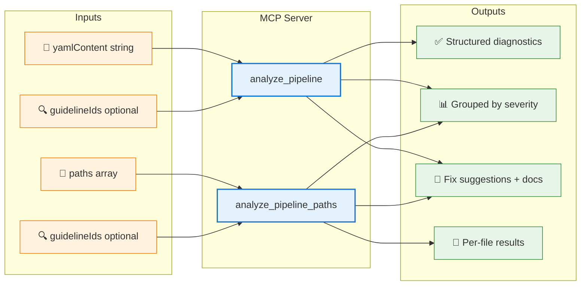

# MCP Server Reference — `adog-mcp`

The `adog-mcp` MCP server gives AI assistants live access to Azure Pipelines coding guideline analysis. Instead of relying only on training data, your AI tool can analyze your actual pipeline files against the current guidelines and return precise, rule-keyed diagnostics.

## Table of Contents

- [What is MCP?](#what-is-mcp)
- [How it works](#how-it-works)
- [Installation](#installation)
  - [Option 1 — .NET global tool](#option-1--net-global-tool)
  - [Option 2 — Docker container](#option-2--docker-container)
- [Configuration](#configuration)
  - [Claude Desktop](#claude-desktop)
  - [GitHub Copilot (VS Code)](#github-copilot-vs-code)
  - [Cline](#cline)
- [Available tools](#available-tools)
- [Usage examples](#usage-examples)
- [Troubleshooting](#troubleshooting)
- [See also](#see-also)

## What is MCP?

[Model Context Protocol (MCP)](https://modelcontextprotocol.io) is an open standard that lets AI assistants connect to external tools and data sources. Think of it as a plugin system for AI: instead of relying only on training data, the assistant calls a running server to get live, structured results.

The MCP server runs as a local process. The AI client starts it and communicates over `stdin`/`stdout`. No network port is opened.

Without the MCP server, the AI can only advise based on training data. With it running, the AI analyzes your actual pipeline file against the current guidelines and returns precise, rule-keyed diagnostics.

## How it works

Here is how the MCP server fits into your workflow:


The server runs as a child process of your AI client. Communication happens over standard input/output streams (stdio transport).

## Installation

### Option 1 — .NET global tool

**Prerequisites:** [.NET 10 SDK](https://dotnet.microsoft.com/download/dotnet/10.0)

Install the MCP server globally:

```bash
dotnet tool install -g adog-mcp
```

Update to the latest version:

```bash
dotnet tool update -g adog-mcp
```

Uninstall:

```bash
dotnet tool uninstall -g adog-mcp
```

### Option 2 — Docker container

**Prerequisites:** [Docker Desktop](https://docs.docker.com/get-docker/)

Pull the latest image:

```bash
docker pull ruijarimba/azure-pipelines-guidelines-mcp:latest
```

No .NET SDK required — the container includes the runtime.

## Configuration

### Claude Desktop

Edit your Claude Desktop configuration file:

**Windows:**
```
%APPDATA%\Claude\claude_desktop_config.json
```

**macOS:**
```
~/Library/Application Support/Claude/claude_desktop_config.json
```

**Linux:**
```
~/.config/Claude/claude_desktop_config.json
```

#### Using the global tool:

```json
{
  "mcpServers": {
    "azure-pipelines-guidelines": {
      "command": "adog-mcp"
    }
  }
}
```

#### Using Docker:

```json
{
  "mcpServers": {
    "azure-pipelines-guidelines": {
      "command": "docker",
      "args": ["run", "-i", "--rm", "ruijarimba/azure-pipelines-guidelines-mcp:latest"]
    }
  }
}
```

The `-i` flag keeps stdin open, which is required for the stdio transport.

### GitHub Copilot (VS Code)

Create or edit `.vscode/mcp.json` in your project:

#### Using the global tool:

```json
{
  "servers": {
    "azure-pipelines-guidelines": {
      "type": "stdio",
      "command": "adog-mcp"
    }
  }
}
```

#### Using Docker:

```json
{
  "servers": {
    "azure-pipelines-guidelines": {
      "type": "stdio",
      "command": "docker",
      "args": ["run", "-i", "--rm", "ruijarimba/azure-pipelines-guidelines-mcp:latest"]
    }
  }
}
```

### Cline

Cline follows the Claude Desktop configuration format. Edit your Cline MCP settings file and use the same JSON structure as shown in the [Claude Desktop](#claude-desktop) section above.

## Available tools

The MCP server exposes two tools:



**Capability matrix:**

| Tool | Input mode | Accepts dirs | Returns | Best for |
| --- | --- | --- | --- | --- |
| `analyze_pipeline` | Inline YAML string | ❌ | Single result | Pasted snippets, chat context |
| `analyze_pipeline_paths` | File/directory paths | ✅ recursive | Per-file results | Workspace files, batch analysis |

### `analyze_pipeline`

Analyzes inline Azure Pipelines YAML content.

**Input:**
- `yamlContent` (string, required) — The pipeline YAML to analyze
- `guidelineIds` (string, optional) — Comma-separated list of rule IDs to check (e.g., `ADOG-STEPS-001,ADOG-JOBS-006`). If omitted, all rules are checked.

**Returns:**
- Structured analysis result with violations grouped by severity (error, warning, info)
- Each violation includes: rule ID, message, line/column, fix suggestion, and documentation link

### `analyze_pipeline_paths`

Analyzes one or more pipeline files or directories on disk.

**Input:**
- `paths` (array of strings, required) — File paths or directory paths to analyze
- `guidelineIds` (string, optional) — Comma-separated list of rule IDs to check

**Returns:**
- Per-file analysis results
- Each file includes its path and a list of violations (same structure as `analyze_pipeline`)

Both tools accept directories and recursively search for `.yml` and `.yaml` files.

## Usage examples

### Ask about a specific guideline

> "What does rule ADOG-STEPS-001 check for?"

The AI will use the MCP server to look up the rule details and explain it.

### Analyze inline YAML

> "Review this pipeline for issues:
> ```yaml
> steps:
>   - script: echo $(DEPLOY_ENV)
> ```"

The AI will call `analyze_pipeline` with your YAML snippet and report any violations.

### Analyze files in your workspace

> "Check all pipeline files in the `.azuredevops` directory"

The AI will call `analyze_pipeline_paths` with the directory path and summarize findings.

### Filter by specific rules

> "Check this pipeline for timeout issues only"

The AI can filter by category (e.g., `ADOG-JOBS-*`, `ADOG-STEPS-*`) or specific rule IDs.

## Troubleshooting

### "MCP server not found" or "command not found"

**If using the global tool:**
- Verify installation: `dotnet tool list -g | grep adog-mcp`
- Ensure the .NET tools directory is in your PATH:
  - **Windows:** `%USERPROFILE%\.dotnet\tools`
  - **macOS/Linux:** `~/.dotnet/tools`

**If using Docker:**
- Verify the image is pulled: `docker images | grep azure-pipelines-guidelines-mcp`
- Ensure Docker Desktop is running

### AI assistant doesn't see the MCP server

1. **Restart the AI client** after editing the configuration file
2. **Check the config file path** — make sure you edited the correct file for your platform
3. **Validate JSON syntax** — use a JSON validator to check for syntax errors
4. **Check logs** — most MCP clients log startup issues to a developer console or log file

### "Tool execution failed"

- **For file analysis:** Ensure the file paths are absolute or relative to your workspace root
- **For directory analysis:** Verify the directory exists and contains `.yml` or `.yaml` files
- **Check permissions:** Ensure the MCP server process can read the files

### Server starts but doesn't return results

- Verify you're passing valid Azure Pipelines YAML (not GitHub Actions or GitLab CI syntax)
- Check if the YAML file is well-formed — run `adog analyze <file>` from the CLI to see detailed errors

## See also

- [CLI Reference](cli-reference.md) — command-line tool usage
- [Azure Pipelines Guidelines repository](https://github.com/ruijarimba/azure-pipelines-guidelines) — rule definitions
- [Model Context Protocol specification](https://modelcontextprotocol.io) — MCP standard documentation
- [Architecture guide](architecture.md) — how the analysis engine works
