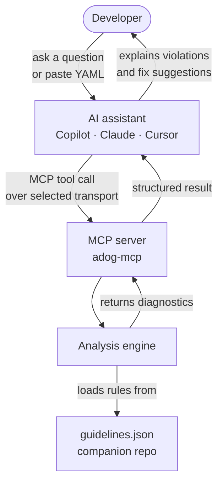

# MCP Server Reference — `adog-mcp`

The `adog-mcp` MCP server gives AI assistants live access to Azure Pipelines coding guideline analysis. Instead of relying only on training data, your AI tool can analyze your actual pipeline files against the current guidelines and return precise, rule-keyed diagnostics.

## Capability summary

The table below shows the complete MCP surface. Use the linked sections for details and examples.

| Type | Name or URI | Purpose | Cacheable | Status |
| --- | --- | --- | --- | --- |
| Tool | `analyze_pipeline` | Analyze inline YAML content | No | Available |
| Tool | `analyze_pipeline_paths` | Analyze files or directories on disk | No | Available |
| Tool | `list_guidelines` | List guideline summaries | No | Available |
| Tool | `get_guideline` | Get one guideline by ID | No | Available |
| Tool | `search_guidelines` | Search guidelines by text | No | Available |
| Tool | `list_categories` | List guideline categories | No | Available |
| Resource | `adog://capabilities` | Discover server and MCP capabilities | Yes | Available |
| Resource | `adog://guidelines` | Read the full guideline catalogue | Yes | Available |
| Resource | `adog://guidelines/version` | Check the catalogue version | Yes | Available |
| Resource | `adog://guidelines/category/{category}` | Read one catalogue category | Yes | Available |
| Resource | `adog://guidelines/{id}` | Read one guideline in full | Yes | Available |
| Resource | `adog://guidelines/{id}/automation` | Read guideline automation metadata | Yes | Available |
| Prompt | — | Guided MCP prompt templates | — | Not implemented |

The server currently exposes tools and resources only. The prompt row records the planned MCP
surface so clients and contributors can see the full capability plan in one place.

## Table of Contents

- [Capability summary](#capability-summary)
- [What is MCP?](#what-is-mcp)
- [How it works](#how-it-works)
- [Choose a transport](#choose-a-transport)
- [Installation](#installation)
  - [Option 1 — Local clone](#option-1--local-clone)
  - [Option 2 — Docker Compose](#option-2--docker-compose)
- [Configuration](#configuration)
  - [Claude Desktop](#claude-desktop)
  - [GitHub Copilot (VS Code)](#github-copilot-vs-code)
  - [Cline](#cline)
- [Available tools](#available-tools)
- [Resources](#resources)
- [Prompts](#prompts)
- [Usage examples](#usage-examples)
- [Troubleshooting](#troubleshooting)
- [See also](#see-also)

## What is MCP?

[Model Context Protocol (MCP)](https://modelcontextprotocol.io) is an open standard that lets AI assistants connect to external tools and data sources. Think of it as a plugin system for AI: instead of relying only on training data, the assistant calls a running server to get live, structured results.

`adog-mcp` supports two ways for a client to connect: a locally started process that uses
standard input/output (`stdio`), and an HTTP endpoint. Choose the transport that matches where
the client and server run. The server does not require one transport to be primary.

Without the MCP server, the AI can only advise based on training data. With it running, the AI analyzes your actual pipeline file against the current guidelines and returns precise, rule-keyed diagnostics.

## Quick decision

| If your client... | Use this transport |
| --- | --- |
| Starts the server as a local process | `stdio` |
| Connects to an already-running server | HTTP transport |

Choose `stdio` for local editor integrations and Docker. Choose the HTTP transport for Visual Studio debugging or a hosted deployment.

## How it works

Here is how the MCP server fits into your workflow:



The server can run as a child process of the AI client or as a separately running HTTP service.

## Choose a transport

Choose the transport based on the deployment boundary and your MCP client support. Both
transports expose the same tools and resources.

| Transport | Use it when | Connection and lifecycle | Key considerations |
| --- | --- | --- | --- |
| `stdio` | The client starts the server on the same machine. | The client communicates with its child process through `stdin` and `stdout`. | No listening port. The client owns the process lifetime. |
| HTTP transport | The client connects to an already-running server. | The client sends MCP requests to the `/mcp` HTTP endpoint. | Supports local debugging and remote hosting. Secure remote access with HTTPS, authentication, and authorization. |

`stdio` is the current executable default. It is not a general recommendation over HTTP. It is
the practical default for clients that launch a local command, including the Docker command in
this repository.

Use the HTTP transport when the client must connect to a server that is already running, such as a
local debugging setup or a hosted deployment. The host uses the HTTP endpoint at `/mcp` for this
mode. As of the MCP 2.0 SDK, this endpoint serves the modern **Streamable HTTP** transport by
default and additionally accepts the legacy HTTP+SSE transport for backward compatibility with
older SSE-only clients. The `Debug` launch profile is the recommended Visual Studio entry point
for local debugging; the existing `SSE` launch-profile and `--transport sse` selector names remain
for compatibility and start the same HTTP host with both transports enabled.

### HTTP endpoint

Use an MCP client that supports the HTTP transport when you want the client to connect to an
already-running host. Configure the client with this endpoint:

```text
http://localhost:5050/mcp
```

The exact startup method depends on the host environment. The important point is that the client
must support the selected transport and connect to the running server endpoint.

## Installation

### Option 1 — Local clone

**Prerequisites:** [.NET 10 SDK](https://dotnet.microsoft.com/download/dotnet/10.0) and a local clone of this repository.

Run the MCP server from the repository root:

```bash
pwsh ./scripts/run-mcp-local.ps1
```

The script starts the server over standard input/output. It waits for an MCP client request;
that is expected. You can also run `dotnet run --project tools/AzurePipelines.Guidelines.Mcp.Host`.

### Option 2 — Docker Compose

**Prerequisites:** [Docker Desktop](https://docs.docker.com/get-docker/)

Start the published HTTP container from the repository root:

```powershell
pwsh ./scripts/run-mcp-compose.ps1
```

The default endpoint is `http://localhost:8080/mcp`. Compose does not use `.env` when running the
MCP server. Stop the service with:

```powershell
docker compose down
```

The image uses Streamable HTTP by default and listens on port `8080` inside the container. If an
MCP client launches Docker as a child process, use stdio explicitly instead:

```powershell
docker run -i --rm -e MCP_TRANSPORT=stdio ruijarimba/azure-pipelines-guidelines-mcp:latest
```

To publish a multi-architecture `latest` image to Docker Hub, copy `.env.example` to `.env`, set the
Docker Hub values, and run:

```powershell
pwsh ./scripts/publish-mcp-image.ps1
```

The publishing script uses the token only for Docker Hub login. It does not pass credentials into
the MCP container.

For hosted deployments, terminate HTTPS at the reverse proxy, ingress controller, load balancer,
or managed container platform. Add authentication and authorization before exposing `/mcp` outside
a trusted network. The container does not manage public TLS certificates.

## Configuration

### Claude Desktop

Edit your Claude Desktop configuration file:

**Windows:**
```
%APPDATA%\Claude\claude_desktop_config.json
```

**macOS:**
```
~/Library/Application Support/Claude/claude_desktop_config.json
```

**Linux:**
```
~/.config/Claude/claude_desktop_config.json
```

#### Using a local clone:

```json
{
  "mcpServers": {
    "azure-pipelines-guidelines": {
      "command": "dotnet",
      "args": [
        "run",
        "--project",
        "/absolute/path/to/azure-pipelines-guidelines-ai-mcp/tools/AzurePipelines.Guidelines.Mcp.Host",
        "--"
      ]
    }
  }
}
```

#### Using Docker Compose:

```json
{
  "mcpServers": {
    "azure-pipelines-guidelines": {
      "type": "http",
      "url": "http://localhost:8080/mcp"
    }
  }
}
```

Start the service with `pwsh ./scripts/run-mcp-compose.ps1` before connecting. For a client that only supports
stdio, configure it to run `docker run -i --rm -e MCP_TRANSPORT=stdio` instead.

### GitHub Copilot (VS Code)

Create or edit `.vscode/mcp.json` in your project:

#### Using a local clone:

```json
{
  "servers": {
    "azure-pipelines-guidelines": {
      "type": "stdio",
      "command": "dotnet",
      "args": [
        "run",
        "--project",
        "/absolute/path/to/azure-pipelines-guidelines-ai-mcp/tools/AzurePipelines.Guidelines.Mcp.Host",
        "--"
      ]
    }
  }
}
```

#### Using a local Docker image:

```json
{
  "servers": {
    "azure-pipelines-guidelines": {
      "type": "stdio",
      "command": "docker",
      "args": ["run", "-i", "--rm", "adog-mcp:local"]
    }
  }
}
```

### Cline

Cline follows the Claude Desktop configuration format. Edit your Cline MCP settings file and use the same JSON structure as shown in the [Claude Desktop](#claude-desktop) section above.

## Available tools

The MCP server exposes six tools plus resource-based catalogue endpoints in the current implementation:

| Tool | Purpose |
| --- | --- |
| `analyze_pipeline` | Analyze inline YAML content |
| `analyze_pipeline_paths` | Analyze files or directories on disk |
| `list_guidelines` | List guidelines from the manifest |
| `get_guideline` | Show a single guideline by ID |
| `search_guidelines` | Search guidelines by text |
| `list_categories` | List the supported categories |

### `analyze_pipeline`

Analyzes inline Azure Pipelines YAML content.

**Input:**
- `yaml` (string, required) — The pipeline YAML to analyze
- `guidelineIds` (string, optional) — Comma-separated list of rule IDs to check. If omitted, all rules are checked.
- `category` (string, optional) — Category filter for analysis options

**Returns:**
- Structured analysis result with diagnostics and rule metadata

### `analyze_pipeline_paths`

Analyzes one or more pipeline files or directories on disk.

**Input:**
- `paths` (array of strings, required) — File paths or directory paths to analyze
- `guidelineIds` (string, optional) — Comma-separated list of rule IDs to check
- `category` (string, optional) — Category filter for analysis options

**Returns:**
- Per-file analysis results with any found diagnostics

#### File-access boundary

The server reads files with the permissions of the process started by your AI client. Use only
workspace paths that you intend the server to analyze. Do not configure the client to run the
server with access to directories that contain secrets, credentials, or unrelated sensitive files.

When using Docker, the container cannot read host files unless you explicitly mount a directory.
Mount only the workspace or pipeline directory you want to analyze as read-only, then pass paths
inside that container mount to `analyze_pipeline_paths`. For example, add these arguments before
the `adog-mcp:local` image tag in the MCP client configuration:

```json
[
  "--mount",
  "type=bind,source=H:\\src\\pipeline-repository,target=/workspace,readonly"
]
```

Use `/workspace/azure-pipelines.yml` when calling the file-path analysis tool. Replace the
example source path with the absolute host path that Docker Desktop can access.

### Guideline lookup tools

The server also exposes lookup helpers for the guideline catalogue:

- `list_guidelines` returns a compact list of guideline summaries for browsing or filtering.
- `get_guideline` returns a compact summary by default. Pass `detail=full` when you need the full description, detection hints, fix advice, and references.
- `search_guidelines` searches by text.
- `list_categories` lists the supported categories.

## Resources

Resource endpoints are useful when a client wants to cache the catalogue or fetch a narrower slice of data. They are smaller and more predictable than repeatedly requesting the full list.

- `adog://guidelines` returns the full guideline catalogue as a JSON array of summaries.
- `adog://guidelines/version` returns a small JSON object with the current catalogue version, for example `{"version":"..."}`. Clients can cache this and skip reloading the catalogue when it is unchanged.
- `adog://capabilities` returns a compact, cacheable description of the server version, catalogue version, supported transports, available tools, resources, and future capability flags.

The capabilities resource is intended for client discovery rather than analysis. Its `tools`,
`resources`, and `prompts` arrays describe the currently exposed MCP surface. The `supports`
object reports optional features that clients should not assume are available. Automation metadata
is supported. Prompts remain unsupported.

Example capability fields:

```json
{
  "server": "azure-pipelines-guidelines",
  "version": "1.0.0",
  "catalogueVersion": "...",
  "transports": ["stdio", "streamable-http"],
  "supports": {
     "automationMetadata": true,
    "prompts": false
  }
}
```
- `adog://guidelines/category/{category}` returns the entries for one category, such as `adog://guidelines/category/steps`.
- `adog://guidelines/{id}` returns the full detail for one guideline, such as `adog://guidelines/ADOG-STEPS-001`.
- `adog://guidelines/{id}/automation` returns the local automation status and reason for one guideline.

Full guideline responses from `get_guideline` with `detail=full` and `adog://guidelines/{id}` also
include `automationStatus` and `automationReason`. The status is `enforceable`, `heuristic`, or
`notAutomatable`.

## Prompts

The server does not currently expose MCP prompts. Prompt support is reserved for a future
increment and is shown as **Not implemented** in the [capability summary](#capability-summary).

## Usage examples

### Ask about a specific guideline

> "What does rule ADOG-STEPS-001 check for?"

The AI will use the MCP server to look up the rule details and explain it.

### Analyze inline YAML

> "Review this pipeline for issues:
> ```yaml
> steps:
>   - script: echo $(DEPLOY_ENV)
> ```"

The AI will call `analyze_pipeline` with your YAML snippet and report any violations.

### Analyze files in your workspace

> "Check all pipeline files in the `.azuredevops` directory"

The AI will call `analyze_pipeline_paths` with the directory path and summarize findings.

### Filter by specific rules

> "Check this pipeline for timeout issues only"

The AI can filter by category (e.g., `ADOG-JOBS-*`, `ADOG-STEPS-*`) or specific rule IDs.

## Debug through HTTP with Visual Studio

`stdio` keeps the protocol stream tied to the client process. That makes it hard to debug the
server inside Visual Studio while a separate MCP client sends requests.

For that workflow, start the host HTTP transport. The server listens on a local HTTP port, so
you can start it in Visual Studio and connect a supported client to the running instance.

### 1. Start the server in Visual Studio

In Visual Studio, set the run/debug profile to **Debug** before you start debugging. The profile
is the recommended local-debug entry point and starts the host HTTP transport:

1. Open the `tools/AzurePipelines.Guidelines.Mcp.Host` project.
2. In the toolbar, click the run/debug profile dropdown (normally shows the project name).
3. Select **Debug**.
4. Press **F5** (or choose **Debug &gt; Start Debugging**).

The server starts on `http://localhost:5050/mcp` by default. The process stays alive as long as
the debugger is attached, and breakpoints in the host and library projects will be hit.

To start from the command line instead of Visual Studio:

```bash
dotnet run --project tools/AzurePipelines.Guidelines.Mcp.Host -- --transport sse --urls "http://localhost:5050"
```

### 2. Configure a client to connect over HTTP

Edit `.vscode/mcp.json` in the workspace you want the AI to analyze:

```json
{
  "servers": {
    "azure-pipelines-guidelines": {
      "type": "http",
      "url": "http://localhost:5050/mcp"
    }
  }
}
```

Save the file. VS Code will connect to the running server. You do not need to restart the
server when you change the client configuration.

### 3. Stop the debug session

The server runs only while the Visual Studio debugger is attached. To stop it, detach or stop
debugging in Visual Studio. The VS Code client will lose its connection until you start the
server again.

### Debug and hosting notes

- The current executable defaults to `stdio`. Choose HTTP when a supported client must connect
  to an already-running server.
- The development profile binds to `localhost` by default. For a remote deployment, configure
  HTTPS, authentication, authorization, and network access controls before making the endpoint
  reachable by other machines.
- If port `5050` is in use, change the **Debug** launch profile in
  `tools/AzurePipelines.Guidelines.Mcp.Host/Properties/launchSettings.json`, or pass
  `--urls "http://localhost:<port>"` when starting from the command line. If you change the
  port, update the `url` value in VS Code's `mcp.json` to match.
- You can also start the HTTP transport with `MCP_TRANSPORT=sse`, but the `--transport`
  command-line argument takes priority. This value is an implementation selector name, not a
  statement that the endpoint uses legacy HTTP+SSE.

## Troubleshooting

### "MCP server not found" or "command not found"

**If using a local clone:**
- Verify the .NET SDK is available: `dotnet --version`
- Run `dotnet run --project tools/AzurePipelines.Guidelines.Mcp.Host` from the repository root
- Verify the configured project path is absolute and points to the MCP host project

**If using Docker:**
- Build the image: `pwsh ./scripts/build-mcp-image.ps1`
- Verify the local image: `docker image inspect adog-mcp:local`
- Ensure Docker Desktop is running

### AI assistant doesn't see the MCP server

1. **Restart the AI client** after editing the configuration file
2. **Check the config file path** — make sure you edited the correct file for your platform
3. **Validate JSON syntax** — use a JSON validator to check for syntax errors
4. **Check logs** — most MCP clients log startup issues to a developer console or log file

### "Tool execution failed"

- **For file analysis:** Ensure the file paths are absolute or relative to your workspace root
- **For directory analysis:** Verify the directory exists and contains `.yml` or `.yaml` files
- **Check permissions:** Ensure the MCP server process can read the files

### Server starts but doesn't return results

- Verify you're passing valid Azure Pipelines YAML (not GitHub Actions or GitLab CI syntax)
- Check if the YAML file is well-formed — run `adog analyze <file>` from the CLI to see detailed errors

## See also

- [CLI Reference](cli-reference.md) — command-line tool usage
- [Azure Pipelines Guidelines repository](https://github.com/ruijarimba/azure-pipelines-guidelines) — rule definitions
- [Model Context Protocol specification](https://modelcontextprotocol.io) — MCP standard documentation
- [Architecture guide](architecture.md) — how the analysis engine works
