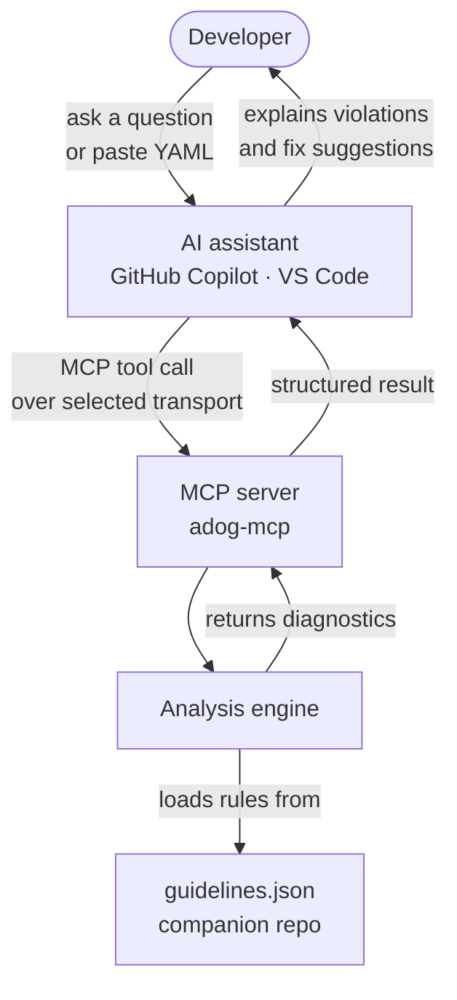

# MCP Server Reference — `adog-mcp`

The `adog-mcp` MCP server gives AI assistants live access to Azure Pipelines coding guideline analysis. Instead of relying only on training data, your AI tool can analyze your actual pipeline files against the current guidelines and return precise, rule-keyed diagnostics.

This is a static, deterministic MCP server. It does not use retrieval-augmented generation (RAG), vector search, an LLM, or model-generated analysis. The server parses YAML, loads the guideline manifest, evaluates the implemented rules, and returns structured results. The connected AI client may add its own explanations, but that behavior is outside this server.

## Capability summary

The tables below show the complete MCP surface. Use the linked sections for details and examples.

### Tools

| Tool | Purpose | Status |
| --- | --- | --- |
| `analyze_template_or_folder` | Analyze a pipeline or template from YAML, a file, or a directory | Available |
| `list_guidelines` | List guideline summaries | Available |
| `get_guideline` | Get one guideline by ID | Available |
| `search_guidelines` | Search guidelines by text | Available |
| `list_categories` | List guideline categories | Available |
| `explain_diagnostic` | Explain one guideline diagnostic in focused detail | Available |

### Resources

| Resource | Purpose | Cacheable | Status |
| --- | --- | --- | --- |
| `adog://capabilities` | Discover server and MCP capabilities | Yes | Available |
| `adog://guidelines` | Read the full guideline catalogue | Yes | Available |
| `adog://guidelines/version` | Check the catalogue version | Yes | Available |
| `adog://guidelines/category/{category}` | Read one catalogue category | Yes | Available |
| `adog://guidelines/{id}` | Read one guideline in full | Yes | Available |
| `adog://guidelines/{id}/automation` | Read guideline automation metadata | Yes | Available |

### Prompts

| Prompt | Inputs | Purpose | Status |
| --- | --- | --- | --- |
| `review` | `fileOrPath` (optional) | Review inline YAML, a file, or a directory | Available |
| `review-summary` | None | Summarize violations across all repository pipeline YAML files | Available |
| `review-category` | `category`, `fileOrPath` (optional) | Review one guideline category | Available |
| `review-guideline` | `guidelineIds`, `fileOrPath` (optional) | Review selected rules | Available |
| `explain-guideline` | `guidelineId`, `detail` (optional) | Explain one guideline | Available |
| `find-guidelines` | `query`, `category` (optional) | Search the guideline catalogue | Available |
| `list-guidelines` | `category` (optional) | List guideline summaries | Available |
| `list-categories` | None | List supported categories | Available |

## Server discovery metadata

During initialization, the server identifies itself as `azure-pipelines-guidelines` with the title **Azure Pipelines YAML Guidelines**. Its description states that it provides deterministic analysis and guideline lookup for Azure Pipelines YAML pipelines and reusable templates. It also provides the project website URL.

Each advertised tool, resource, and prompt has a stable identifier, a title, and a short description. These fields help MCP clients recognize that `analyze_template_or_folder` is the primary capability for reviewing Azure Pipelines YAML pipelines and templates.

The metadata helps a client select a relevant capability. It does not require a model or client to invoke that capability.

## Table of Contents

- [Capability summary](#capability-summary)
- [Server discovery metadata](#server-discovery-metadata)
- [What is MCP?](#what-is-mcp)
- [How it works](#how-it-works)
- [Choose a transport](#choose-a-transport)
- [Installation](#installation)
  - [Option 1 — Docker Hub image](#option-1--docker-hub-image)
  - [Option 2 — Local clone](#option-2--local-clone)
- [Configuration](#configuration)
  - [GitHub Copilot (VS Code)](#github-copilot-vs-code)
- [Available tools](#available-tools)
- [Resources](#resources)
- [Prompts](#prompts)
- [Usage examples](#usage-examples)
- [Troubleshooting](#troubleshooting)
- [See also](#see-also)

## What is MCP?

[Model Context Protocol (MCP)](https://modelcontextprotocol.io) is an open standard that lets AI assistants connect to external tools and data sources. Think of it as a plugin system for AI: instead of relying only on training data, the assistant calls a running server to get live, structured results.

This server is built using the [official C# MCP SDK](https://github.com/modelcontextprotocol/csharp-sdk), which provides the protocol implementation and transport layers.

`adog-mcp` supports two ways for a client to connect: a locally started process that uses standard input/output (`stdio`), and an HTTP endpoint. Choose the transport that matches where the client and server run. The server does not require one transport to be primary.

Without the MCP server, the AI can only advise based on training data. With it running, the AI analyzes your actual pipeline file against the current guidelines and returns precise, rule-keyed diagnostics.

## Quick decision

| If your client... | Use this transport |
| --- | --- |
| Starts the server as a local process | `stdio` |
| Connects to an already-running server | HTTP transport |

Choose `stdio` for local editor integrations and Docker. Choose the HTTP transport for Visual Studio debugging or a hosted deployment.

## How it works

Here is how the MCP server fits into your workflow:



The server can run as a child process of the AI client or as a separately running HTTP service.

## Choose a transport

Choose the transport based on the deployment boundary and your MCP client support. Both transports expose the same tools and resources.

| Transport | Use it when | Connection and lifecycle | Key considerations |
| --- | --- | --- | --- |
| `stdio` | The client starts the server on the same machine. | The client communicates with its child process through `stdin` and `stdout`. | No listening port. The client owns the process lifetime. |
| HTTP transport | The client connects to an already-running server. | The client sends MCP requests to the `/mcp` HTTP endpoint. | Supports local debugging and remote hosting. Secure remote access with HTTPS, authentication, and authorization. |

`stdio` is the current executable default. It is not a general recommendation over HTTP. It is the practical default for clients that launch a local command, including the Docker command in this repository.

Use the HTTP transport when the client must connect to a server that is already running, such as a local debugging setup or a hosted deployment. The host uses the HTTP endpoint at `/mcp` for this mode. This endpoint serves the modern **Streamable HTTP** transport by default and additionally accepts the legacy HTTP+SSE transport for backward compatibility with older SSE-only clients. The `Debug` launch profile is the recommended Visual Studio entry point for local debugging; the existing `SSE` launch-profile and `--transport sse` selector names remain for compatibility and start the same HTTP host with both transports enabled.

### HTTP endpoint

Use an MCP client that supports the HTTP transport when you want the client to connect to an already-running host. Configure the client with this endpoint:

```text
http://localhost:5050/mcp
```

The exact startup method depends on the host environment. The important point is that the client must support the selected transport and connect to the running server endpoint.

## Installation

### Option 1 — Docker Hub image

**Prerequisites:** [Docker Desktop](https://docs.docker.com/get-docker/) and an MCP client that supports stdio servers. This is the fastest way to try the server: it does not require a repository clone, the .NET SDK, or a local build. Published images are built only after the complete solution test suite passes in the Docker build stage.

The published image uses HTTP by default, so set `MCP_TRANSPORT=stdio` when an MCP client starts the container as a child process. For GitHub Copilot in VS Code, create or edit `.vscode/mcp.json` in the workspace you want to use:

```json
{
  "servers": {
    "azure-pipelines-guidelines": {
      "type": "stdio",
      "command": "docker",
      "args": [
        "run",
        "-i",
        "--rm",
        "--pull",
        "always",
        "--mount",
        "type=bind,source=${workspaceFolder},target=/workspace,readonly",
        "--workdir",
        "/workspace",
        "-e",
        "MCP_TRANSPORT=stdio",
        "ruijarimba/azure-pipelines-guidelines-mcp:latest"
      ]
    }
  }
}
```

`${workspaceFolder}` is expanded by VS Code to the currently open workspace, so this configuration can
be reused across repositories. The workspace is mounted read-only so the server can analyze pipeline
files without modifying them; Copilot can still suggest and apply fixes through the editor.

Restart or reload the MCP server from VS Code after saving the file. The container can analyze inline YAML immediately. The mount makes the current workspace available for `analyze_template_or_folder`, including the `review-summary` prompt; see the [file-access boundary](#file-access-boundary) guidance below.

### Option 2 — Local clone

**Prerequisites:** [.NET 10 SDK](https://dotnet.microsoft.com/download/dotnet/10.0) and a local clone of this repository.

Run the MCP server from the repository root:

```bash
pwsh ./scripts/run-mcp-local.ps1
```

The script starts the server over standard input/output. It waits for an MCP client request; that is expected. You can also run `dotnet run --project tools/AzurePipelines.Guidelines.Mcp.Host`.

## Configuration

For details about adding and managing MCP servers in VS Code, see the official [MCP server documentation](https://code.visualstudio.com/docs/agent-customization/mcp-servers).

### Docker Hub image

```json
{
  "servers": {
    "azure-pipelines-guidelines": {
      "type": "stdio",
      "command": "docker",
      "args": [
        "run",
        "-i",
        "--rm",
        "--pull",
        "always",
        "--mount",
        "type=bind,source=${workspaceFolder},target=/workspace,readonly",
        "--workdir",
        "/workspace",
        "-e",
        "MCP_TRANSPORT=stdio",
        "ruijarimba/azure-pipelines-guidelines-mcp:latest"
      ]
    }
  }
}
```

### Local clone

```json
{
  "servers": {
    "azure-pipelines-guidelines": {
      "type": "stdio",
      "command": "dotnet",
      "args": [
        "run",
        "--project",
        "/absolute/path/to/azure-pipelines-guidelines-ai-mcp/tools/AzurePipelines.Guidelines.Mcp.Host",
        "--"
      ]
    }
  }
}
```

## Available tools

The MCP server exposes six tools plus resource-based catalogue endpoints in the current implementation:

| Tool | Purpose |
| --- | --- |
| `analyze_template_or_folder` | Analyze a pipeline or template from YAML, a file, or a directory |
| `list_guidelines` | List guidelines from the manifest |
| `get_guideline` | Show a single guideline by ID |
| `search_guidelines` | Search guidelines by text |
| `list_categories` | List the supported categories |
| `explain_diagnostic` | Explain one guideline diagnostic in focused detail |

### `analyze_template_or_folder`

Analyzes one Azure Pipelines pipeline or template. Use inline `yaml` content or one `fileOrPath` value. A directory is scanned recursively for supported YAML files. Templates can define steps, jobs, stages, or variables.

**Input:**

- `yaml` (string, optional) — Inline pipeline or template YAML. Pass this or `fileOrPath`, not both.
- `fileOrPath` (string, optional) — One file or directory path. Pass this or `yaml`, not both. If
  resolution fails, the server tries common paths such as `pipelines` in the current repository and
  reports every attempted path if no candidate succeeds.
- `guidelineIds` (string, optional) — Comma-separated list of rule IDs to check. When provided,
  exactly those rules are evaluated regardless of other filters.
- `category` (string, optional) — Category filter for analysis options.
- `includeNonEnforceable` (boolean, optional) — When `true`, also evaluates rules whose automation
  status is `Heuristic` or `NotAutomatable`. Defaults to `false` (enforceable rules only).
- `summaryMode` (boolean, optional) — When `true`, returns compact violation summaries grouped by
  guideline ID instead of individual diagnostics. Defaults to `false`.

**Returns:**

- An object containing `summary` and `diagnostics`.
- When `summaryMode` is `true`, an object containing `summary` and `violations` is returned instead.

`summary` includes `filesAnalyzed`, `filesWithFindings`, and `totalFindings`. When findings exist, it also includes `byRecommendation`, `byCategory`, and `byRule` count maps. The detailed `diagnostics` array contains `ruleId`, `recommendation`, `message`, and optional `line` and `column` values.

The compact `violations` array contains one entry per guideline ID with `ruleId`, `recommendation`,
`category`, `occurrences`, and the number of affected `files`.

Example:

```json
{
  "summary": {
    "filesAnalyzed": 1,
    "filesWithFindings": 1,
    "totalFindings": 2,
    "byRecommendation": { "do": 1, "avoid": 1 },
    "byCategory": { "jobs": 1, "steps": 1 },
    "byRule": { "ADOG-JOBS-006": 1, "ADOG-STEPS-001": 1 }
  },
  "diagnostics": [
    {
      "ruleId": "ADOG-JOBS-006",
      "recommendation": "do",
      "message": "...",
      "line": 24,
      "column": 5
    }
  ]
}
```

The summary is calculated server-side so clients can first identify the number, recommendation type, category, and rule concentration of findings before processing every diagnostic. Count maps are sorted deterministically, and empty maps are omitted.

#### File-access boundary

The server reads files with the permissions of the process started by your AI client. Use only workspace paths that you intend the server to analyze. Do not configure the client to run the server with access to directories that contain secrets, credentials, or unrelated sensitive files.

When using Docker, the container cannot read host files unless you explicitly mount a directory. Mount only the workspace or pipeline directory you want to analyze as read-only, then pass paths inside that container mount to `analyze_template_or_folder`. For example, add these arguments before the `adog-mcp:local` image tag in the MCP client configuration:

```json
[
  "--mount",
  "type=bind,source=H:\\src\\pipeline-repository,target=/workspace,readonly"
]
```

Use `/workspace/azure-pipelines.yml` as the `fileOrPath` value when calling the file-path analysis tool. Replace the example source path with the absolute host path that Docker Desktop can access.

### `explain_diagnostic`

Explains a single Azure Pipelines guideline diagnostic in focused detail. Pass the `guidelineId` from a diagnostic (for example, from an `analyze_template_or_folder` result) to get its full detail payload, without fetching the whole catalogue. Optionally echo back the diagnostic's `message`, `filePath`, `line`, and `column` so the response stays paired with the original finding.

**Input:**

- `guidelineId` (string, required) — The stable guideline identifier, e.g. `ADOG-STEPS-001`.
- `message` (string, optional) — Diagnostic message text to echo back for context.
- `filePath` (string, optional) — File path where the diagnostic was found, to echo back for context.
- `line` (integer, optional) — One-based line number where the diagnostic was found.
- `column` (integer, optional) — One-based column number where the diagnostic was found.

**Returns:**

- An object with `guideline` (the full guideline detail payload: id, title, category, severity,
  description, rationale, tags, detection hints, fix guidance, references, and automation status)
  and an optional `diagnostic` object echoing back any supplied context. `diagnostic` is omitted
  when no context parameters are supplied.

### Guideline lookup tools

The server also exposes lookup helpers for the guideline catalogue:

- `list_guidelines` returns a compact list of guideline summaries for browsing or filtering.
- `get_guideline` returns a compact summary by default. Pass `detail=full` when you need the full description, detection hints, fix advice, and references.
- `search_guidelines` searches by text.
- `list_categories` lists the supported categories.
- `explain_diagnostic` returns one guideline's full detail, optionally paired with the diagnostic context that raised it.

## Resources

Resource endpoints are useful when a client wants to cache the catalogue or fetch a narrower slice of data. They are smaller and more predictable than repeatedly requesting the full list.

- `adog://guidelines` returns the full guideline catalogue as a JSON array of summaries.
- `adog://guidelines/version` returns a small JSON object with the current catalogue version, for example `{"version":"..."}`. Clients can cache this and skip reloading the catalogue when it is unchanged.
- `adog://capabilities` returns a compact, cacheable description of the server identity, catalogue version, supported transports, available tools, resources, prompts, and capability flags.

The capabilities resource is intended for client discovery rather than analysis. It includes `title`, `description`, and `websiteUrl` fields for the server. Its `tools`, `resources`, and `prompts` arrays contain objects with `identifier`, `title`, and `description` fields. The `supports` object reports optional features that clients should not assume are available. Automation metadata and prompts are supported.

Example capability fields:

```json
{
  "server": "azure-pipelines-guidelines",
  "title": "Azure Pipelines YAML Guidelines",
  "description": "Deterministic analysis and guideline lookup for Azure Pipelines YAML pipelines and reusable templates.",
  "websiteUrl": "https://github.com/ruijarimba/azure-pipelines-guidelines-ai-mcp",
  "version": "0.1.0",
  "catalogueVersion": "...",
  "transports": ["stdio", "streamable-http"],
  "tools": [
    {
      "identifier": "analyze_template_or_folder",
      "title": "Analyze Azure Pipelines YAML pipelines and templates",
      "description": "Analyzes inline YAML, pipeline files, reusable templates, or a directory against loaded coding guidelines."
    }
  ],
  "supports": {
    "automationMetadata": true,
    "prompts": true
  }
}
```

- `adog://guidelines/category/{category}` returns the entries for one category, such as `adog://guidelines/category/steps`.
- `adog://guidelines/{id}` returns the full detail for one guideline, such as `adog://guidelines/ADOG-STEPS-001`.
- `adog://guidelines/{id}/automation` returns the local automation status and reason for one guideline.

Full guideline responses from `get_guideline` with `detail=full` and `adog://guidelines/{id}` also include `automationStatus` and `automationReason`. The status is `enforceable`, `heuristic`, or `notAutomatable`.

## Prompts

The server exposes read-only MCP prompts. In VS Code, restart or reload the MCP connection and type `/` in GitHub Copilot Chat to find them. Prompt names are registered without the leading slash; the client displays them as slash commands.

| Prompt | Inputs | Purpose |
| --- | --- | --- |
| `review` | `fileOrPath` (optional, default `/pipelines`) | Selects inline or path-based analysis for YAML, a file, or a directory. |
| `review-summary` | None | Reviews all pipeline YAML files from the repository root and requests a concise Markdown table of grouped violations. |
| `review-category` | `category`, `fileOrPath` (optional, default `/pipelines`) | Reviews a target for one guideline category. |
| `review-guideline` | `guidelineIds`, `fileOrPath` (optional, default `/pipelines`) | Reviews a target against selected rule IDs. |
| `explain-guideline` | `guidelineId`, `detail` (optional) | Explains one guideline from the catalogue. |
| `find-guidelines` | `query`, `category` (optional) | Searches the guideline catalogue. |
| `list-guidelines` | `category` (optional) | Lists guideline summaries. |
| `list-categories` | None | Lists supported guideline categories. |

Prompts return instructions to the MCP client. The client invokes the existing analysis or catalogue tool named by the prompt. These prompts do not modify files, generate patches, or apply fixes.

User-facing prompt output uses guideline recommendation labels: `DO`, `DO-NOT`, `AVOID`, and `CONSIDER`. The prompts do not ask the client to present diagnostic severity labels such as `Error`, `Warning`, or `Info`. Raw analysis responses may still contain `severity` fields for machine consumers, but the predefined prompts present recommendations to users.

## Usage examples

### Ask about a specific guideline

> "What does rule ADOG-STEPS-001 check for?"

The AI will use the MCP server to look up the rule details and explain it.

### Analyze inline YAML

> "Review this pipeline for issues:
> ```yaml
> steps:
>   - script: echo $(DEPLOY_ENV)
> ```"

The AI will call `analyze_template_or_folder` with your YAML snippet and report any violations.

### Analyze files in your workspace

> "Check all pipeline files in the `.azuredevops` directory"

The AI will call `analyze_template_or_folder` with the directory as `fileOrPath` and summarize findings.

### Filter by specific rules

> "Check this pipeline for timeout issues only"

The AI can filter by category (e.g., `ADOG-JOBS-*`, `ADOG-STEPS-*`) or specific rule IDs.

## Debug through HTTP with Visual Studio

`stdio` keeps the protocol stream tied to the client process. That makes it hard to debug the server inside Visual Studio while a separate MCP client sends requests.

For that workflow, start the host HTTP transport. The server listens on a local HTTP port, so you can start it in Visual Studio and connect a supported client to the running instance.

### 1. Start the server in Visual Studio

In Visual Studio, set the run/debug profile to **Debug** before you start debugging. The profile is the recommended local-debug entry point and starts the host HTTP transport:

1. Open the `tools/AzurePipelines.Guidelines.Mcp.Host` project.
2. In the toolbar, click the run/debug profile dropdown (normally shows the project name).
3. Select **Debug**.
4. Press **F5** (or choose **Debug &gt; Start Debugging**).

The server starts on `http://localhost:5050/mcp` by default. The process stays alive as long as the debugger is attached, and breakpoints in the host and library projects will be hit.

To start from the command line instead of Visual Studio:

```bash
dotnet run --project tools/AzurePipelines.Guidelines.Mcp.Host -- --transport sse --urls "http://localhost:5050"
```

### 2. Configure a client to connect over HTTP

Edit `.vscode/mcp.json` in the workspace you want the AI to analyze:

```json
{
  "servers": {
    "azure-pipelines-guidelines": {
      "type": "http",
      "url": "http://localhost:5050/mcp"
    }
  }
}
```

Save the file. VS Code will connect to the running server. You do not need to restart the server when you change the client configuration.

### 3. Stop the debug session

The server runs only while the Visual Studio debugger is attached. To stop it, detach or stop debugging in Visual Studio. The VS Code client will lose its connection until you start the server again.

### Debug and hosting notes

- The current executable defaults to `stdio`. Choose HTTP when a supported client must connect
  to an already-running server.
- The development profile binds to `localhost` by default. For a remote deployment, configure
  HTTPS, authentication, authorization, and network access controls before making the endpoint
  reachable by other machines.
- If port `5050` is in use, change the **Debug** launch profile in
  `tools/AzurePipelines.Guidelines.Mcp.Host/Properties/launchSettings.json`, or pass
  `--urls "http://localhost:<port>"` when starting from the command line. If you change the
  port, update the `url` value in VS Code's `mcp.json` to match.
- You can also start the HTTP transport with `MCP_TRANSPORT=sse`, but the `--transport`
  command-line argument takes priority. This value is an implementation selector name, not a
  statement that the endpoint uses legacy HTTP+SSE.

## Troubleshooting

### "MCP server not found" or "command not found"

**If using a local clone:**

- Verify the .NET SDK is available: `dotnet --version`
- Run `dotnet run --project tools/AzurePipelines.Guidelines.Mcp.Host` from the repository root
- Verify the configured project path is absolute and points to the MCP host project

**If using Docker:**

- Build the image: `pwsh ./scripts/build-mcp-image.ps1`
- Verify the local image: `docker image inspect adog-mcp:local`
- Ensure Docker Desktop is running

### AI assistant doesn't see the MCP server

1. **Restart the AI client** after editing the configuration file
2. **Check the config file path** — make sure you edited the correct file for your platform
3. **Validate JSON syntax** — use a JSON validator to check for syntax errors
4. **Check logs** — most MCP clients log startup issues to a developer console or log file

### "Tool execution failed"

- **For file analysis:** Ensure the file paths are absolute or relative to your workspace root
- **For directory analysis:** Verify the directory exists and contains `.yml` or `.yaml` files
- **Check permissions:** Ensure the MCP server process can read the files

### Server starts but doesn't return results

- Verify you're passing valid Azure Pipelines YAML (not alternative CI syntaxes)
- Check that the YAML file is well-formed. Call `analyze_template_or_folder` with the file content as `yaml` to inspect parsing errors.

## See also

- [MCP token usage guide](mcp-token-usage.md) — how to keep client token usage low
- [Azure Pipelines Guidelines repository](https://github.com/ruijarimba/azure-pipelines-guidelines) — rule definitions
- [Model Context Protocol specification](https://modelcontextprotocol.io) — MCP standard documentation
- [Architecture guide](architecture.md) — how the analysis engine works

