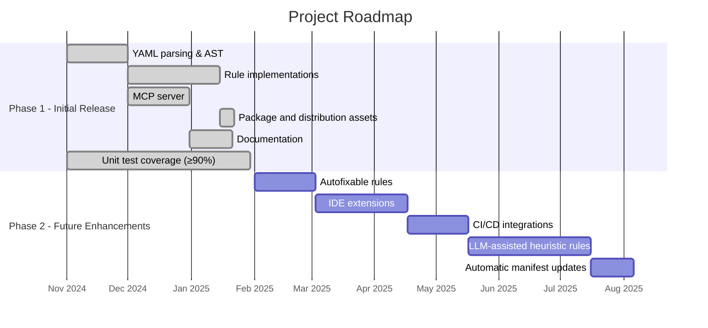

# Vision and roadmap

## North star

Build an MCP server on top of the [Azure Pipelines Guidelines repository](https://github.com/ruijarimba/azure-pipelines-guidelines)
machine-readable manifest. The server makes the guidelines actionable for AI assistants by
providing guideline lookup, pipeline analysis, and fix guidance.

The server consumes the `data/guidelines.json` manifest from the companion repository.

## At a glance

| Focus | Current position |
| --- | --- |
| Phase 1 | The core release is complete and documented |
| Phase 2 | Future work focuses on automation, IDE integrations, and CI/CD adoption |

## In scope

### Phase 1 (initial release) ✅

- Parse Azure Pipelines YAML into a structured AST.
- Implement rules for all `ADOG-{CATEGORY}-{NNN}` guidelines in the manifest.
- MCP server (tools: guideline lookup, YAML analysis, fix suggestions; resources: guideline catalogue with cache-friendly version and category endpoints).
- NuGet package metadata and local packing for all `src/` libraries.
- Global-tool packaging configuration for `adog-mcp`.
- Docker-image distribution assets and Docker Hub publication for `adog-mcp`.
- NuGet publication is deferred. The package configuration remains for a future release.
- Comprehensive unit test coverage (xUnit + FluentAssertions + NSubstitute) with repository-wide line coverage above 90% and explicit tests for success, failure, and edge-case scenarios.

### Phase 2 (future enhancements) 🔮

- Autofixable rules (deterministic text transformations).
- IDE extensions (VS Code, Visual Studio) using the analysis engine.
- CI/CD integrations (Azure Pipelines task and other native automation hooks).
- LLM-assisted analysis for `heuristic` detection rules (excluded from current MCP planning).
- Manifest updates: consume new rules from the companion repository automatically.

## Out of scope

### Permanently out of scope

- Authoring the guidelines — they live in the companion repository.
- Linting for other CI/CD systems.
- Runtime analysis or monitoring — this is a static analyser only.
- Pipeline execution simulation or validation.

### Deferred to Phase 2 or later

- Auto-fixing beyond deterministic text replacements.
- Telemetry or usage analytics.
- Custom user-defined rules.

## Success criteria

### Phase 1 complete when

- All `ADOG-…` rules from `guidelines.json` are implemented.
- MCP server responds correctly to all defined tools and resources.
- Package metadata and local packing remain valid for a future NuGet release.
- Docker image distribution remains available for the MCP server.
- Repository-wide line coverage above 90% (measured via `dotnet test --collect:"XPlat Code Coverage"`).
- Tests must cover normal success paths, failure paths, and edge cases for every behavior change; no change is accepted without broad regression coverage.
- Documentation complete: `AGENTS.md`, `architecture.md`, this file, and per-project `AGENTS.md`.

### Long-term success

- Community adoption: MCP integrations use the server in real development workflows.
- Integration: used in at least one production AI-assisted pipeline review workflow.
- Contribution: external contributor submits a rule implementation or bug fix.
