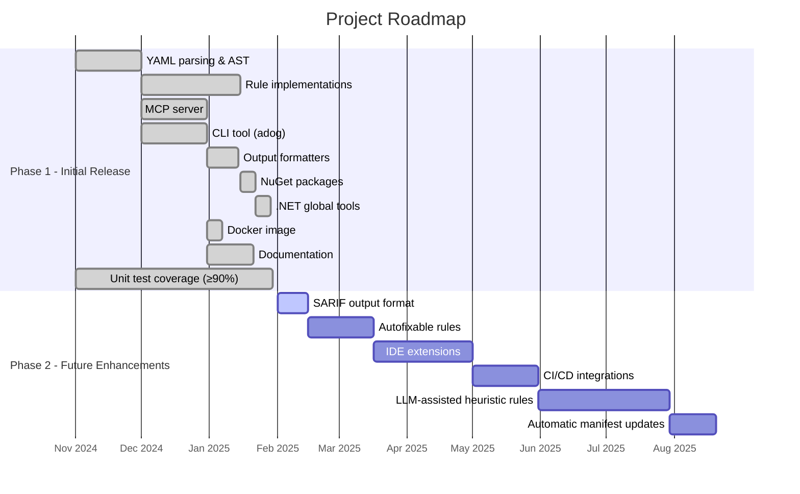

# Vision & Roadmap

## North star

Build **two tools** on top of the [Azure Pipelines Guidelines repository](https://github.com/ruijarimba/azure-pipelines-guidelines)
machine-readable manifest that make the guidelines **actionable** for humans and AI assistants:

1. **MCP server** — AI assistants call it to look up guidelines and analyse pipeline YAML.
2. **CLI static analyser** (`adog`) — runs in CI or locally; flags violations with fix suggestions.

Both tools consume the same `data/guidelines.json` manifest from the companion repository.

## In scope

### Phase 1 (initial release) ✅

- Parse Azure Pipelines YAML into a structured AST.
- Implement rules for all `ADOG-{CATEGORY}-{NNN}` guidelines in the manifest.
- MCP server (tools: guideline lookup, YAML analysis, fix suggestions; resources: guideline catalogue).
- CLI tool (`adog analyze`, `adog rules list`, `adog rules show`).
- JSON and console output formats.
- NuGet packages for all `src/` libraries.
- .NET global tool distribution for `adog` (CLI) and `adog-mcp` (MCP server).
- Docker image for the MCP server (`ruijarimba/azure-pipelines-guidelines-mcp` on Docker Hub),
  so anyone can run the server without installing .NET.
- Comprehensive unit test coverage (xUnit + FluentAssertions + NSubstitute) with repository-wide line coverage above 90% and explicit tests for success, failure, and edge-case scenarios.
},{
### Phase 2 (future enhancements) 🔮

- SARIF output format.
- Autofixable rules (deterministic text transformations).
- IDE extensions (VS Code, Visual Studio) using the analysis engine.
- CI/CD integrations (Azure Pipelines task, GitHub Action).
- LLM-assisted analysis for `heuristic` detection rules.
- Manifest updates: consume new rules from the companion repository automatically.

## Out of scope

### Permanently out of scope

- Authoring the guidelines — they live in the companion repository.
- Linting for GitHub Actions, GitLab CI, Jenkins, or other CI/CD systems.
- Runtime analysis or monitoring — this is a static analyser only.
- Pipeline execution simulation or validation.

### Deferred to Phase 2 or later

- Auto-fixing beyond deterministic text replacements.
- Telemetry or usage analytics.
- Configuration files (`.adog.yml`, `.adog.json`) for rule filtering.
- Custom user-defined rules.

## Success criteria

### Phase 1 complete when

- All `ADOG-…` rules from `guidelines.json` are implemented.
- MCP server responds correctly to all defined tools and resources.
- CLI produces accurate diagnostics and exits with correct codes.
- `src/` packages published to NuGet.org, `adog` and `adog-mcp` published as global tools.
- Docker image published to Docker Hub (`ruijarimba/azure-pipelines-guidelines-mcp`).
- Repository-wide line coverage above 90% (measured via `dotnet test --collect:"XPlat Code Coverage"`).
- Tests must cover normal success paths, failure paths, and edge cases for every behavior change; no change is accepted without broad regression coverage.
- Documentation complete: `AGENTS.md`, `architecture.md`, this file, and per-project `AGENTS.md`.

### Long-term success

- Community adoption: ≥ 100 downloads/week for `adog` global tool within 6 months.
- Integration: used in at least one production CI pipeline.
- Contribution: external contributor submits a rule implementation or bug fix.
