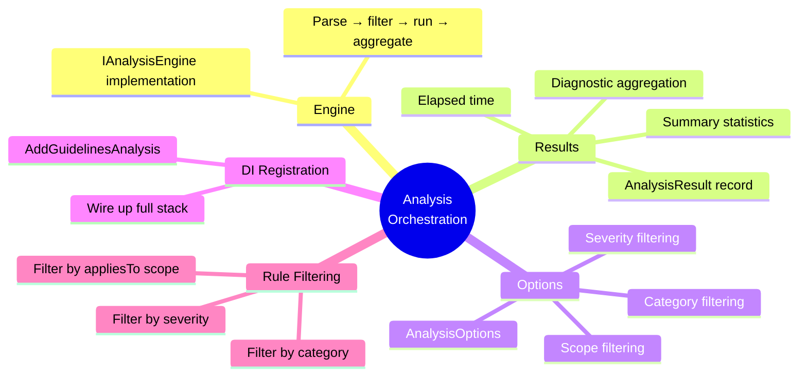
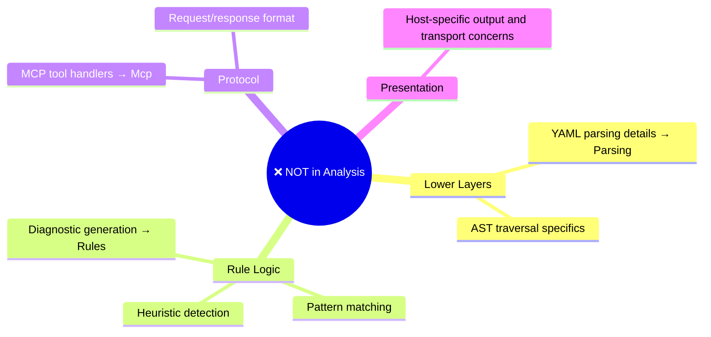

# AGENTS.md — AzurePipelines.Guidelines.Analysis

## Purpose

Orchestrates the full analysis pipeline: parse YAML → filter applicable rules → run rules → aggregate diagnostics into an `AnalysisResult`. This is the reusable entry point for hosts such as the MCP server and future analysis tools.

## What belongs here

**Visual boundary rules:**
- ✅ Orchestration logic — coordinate parse → analyze → aggregate
- ✅ `IAnalysisEngine` implementation — single seam for all callers
- ✅ Result aggregation — collect diagnostics from all rules
- ✅ Filtering logic — decide which rules to run
- ✅ DI wiring — register parser + rules + engine

## What does NOT belong here

**Keep Analysis focused:**
- ❌ No YAML parsing details — use injected `IPipelineParser`
- ❌ No rule implementations — inject `IEnumerable<IGuidelineRule>`
- ❌ No MCP protocol concerns → `Mcp` project
- ❌ No host-specific output, file I/O, or transport concerns

## Dependencies (internal)

- `AzurePipelines.Guidelines.Core`
- `AzurePipelines.Guidelines.Parsing`
- `AzurePipelines.Guidelines.Rules`

## Dependencies (NuGet)

- `Microsoft.Extensions.DependencyInjection.Abstractions` (for `IServiceCollection`)
- `Microsoft.Extensions.Logging.Abstractions` (for `ILogger<T>`)

## Key patterns

- `IAnalysisEngine` is the **single public seam** for all hosts, including `Mcp`.
- Rules are resolved at runtime via `IEnumerable<IGuidelineRule>` — adding a new rule to the DI
  container automatically makes it available to the engine.
- The engine never modifies pipeline files; it produces read-only results only.
- All public methods returning collections return `IReadOnlyList<T>`.
- `AddGuidelinesAnalysis` registers the parser, all rules, and the engine — callers only
  need one call to wire up the full analysis stack.
