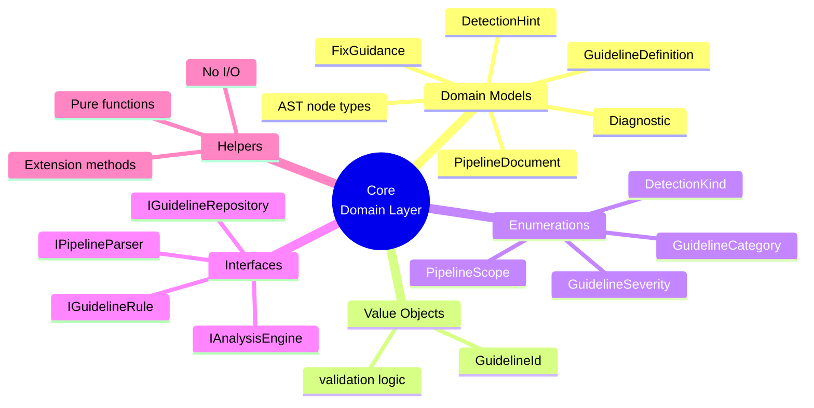
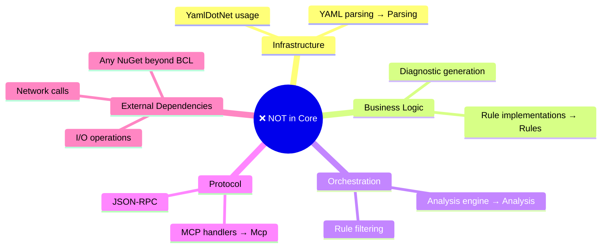

# AGENTS.md — AzurePipelines.Guidelines.Core

## Purpose

The innermost layer of the solution. Owns all **domain contracts**: models, interfaces, enums,
and value objects that every other project depends on.

This project must remain dependency-free with respect to other `src/` projects and must
introduce no NuGet dependencies beyond the .NET BCL.

## What belongs here

**Visual boundary rules:**
- ✅ Domain models (records) — immutable by default
- ✅ Value objects with validation — e.g., `GuidelineId`
- ✅ Enumerations — shared enums across all layers
- ✅ Core interfaces — contracts that other layers implement
- ✅ Pure helpers — no side effects, no external dependencies

## What does NOT belong here

**Keep Core pure:**
- ❌ No YAML parsing logic → `Parsing` project
- ❌ No rule implementations → `Rules` project
- ❌ No analyser orchestration → `Analysis` project
- ❌ No MCP protocol code → `Mcp` project
- ❌ No NuGet dependencies beyond .NET BCL

## Dependencies

**None** within the solution. This project must not reference any other `src/` project.

## Key patterns

- All domain models are **records** (immutable by default).
- `GuidelineId` validates the `ADOG-…` pattern at construction; invalid strings must throw
  `ArgumentException` with a descriptive message.
- All collection properties on public types use `IReadOnlyList<T>` — never `List<T>`.
- Every `public` member carries an XML doc comment.

## Enumerations

The canonical definitions live in [`docs/glossary.md`](../../docs/glossary.md).
This project implements them as C# enums:

| Enum | Values |
| --- | --- |
| `GuidelineCategory` | `General`, `Jobs`, `Parameters`, `Pipelines`, `Stages`, `Steps`, `Variables` |
| `GuidelineSeverity` | `Do`, `DoNot`, `Avoid`, `Consider` |
| `DetectionKind` | `Regex`, `YamlPath`, `Heuristic` |

Severity → diagnostic level mapping is defined in the glossary; implement it as a pure
mapping method or a switch expression on `GuidelineSeverity`.
